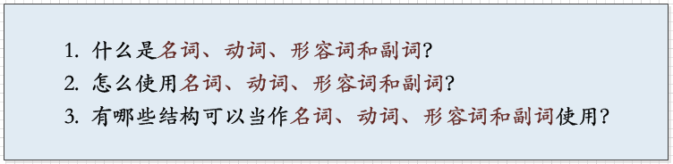
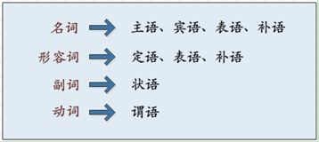
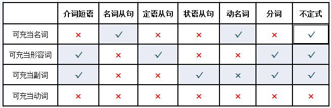
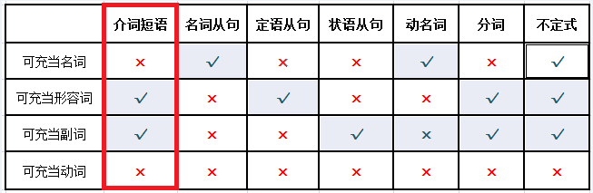
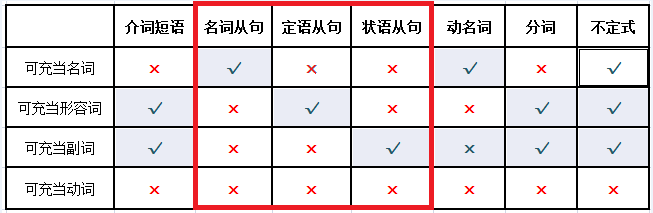
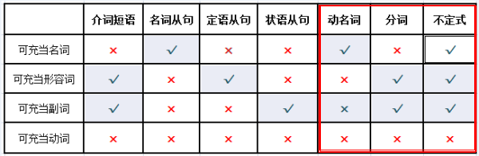

[TOC]

# 四类词

作者：阿丁的猫
链接：https://www.zhihu.com/question/20981568/answer/193088318
来源：知乎

**一、为什么说这四类词很重要？**

**“名词、动词、形容词和副词”**又被称为**“四大词性”**，是贯穿英语语法的一条重要的线索。

可以这样说，英语语法就是解答以下三个问题。

前两个问题是**问题3**的铺垫，所以我们先简单了解一下这四类词性的用法：

- **名词**是人、事物或是抽象概念的名称；
- **动词**用来表示人或事物的动作；
- **形容词**和**副词**是修饰语，用来给被修饰的成分添加附加信息；
- **形容词用来修饰名词和代词；**
- 而副词的用法和形容词正好相反，**副词是用来修饰除名词和代词外的其它结构**，因此，副词能够修饰动词、形容词、副词、短语、句子等。

下图是**“名词、动词、形容词和副词”**与**“主谓宾定状补表”**七类句子成分的关系：

即，**名词**可以作**主语、宾语、表语和补语**；

**形容词**可以作**定语、表语和补语**；

**副词**只可以作**状语**；

**动词**只可以作**谓语**。

请大家先记住这个结论，因为接下来它会发挥很大的作用。

接下来分析问题3（即哪些结构可以当作名词、动词、形容词和副词使用），这个问题才是我们**建立语法框架的关键**，因为英语中绝大部分的句子都是由**“四大词性”**和**“七类辅助结构”（介词短语、三类从句、三类非谓语动词）**所组成的。

而我们在应用这七类辅助结构时，事实上是将它们当作四大词性中的一类来使用的 ，如下列**对应表**所示：

**如何使用上面的对应表？** 

用其中的**介词短语**（“介词 + 名词”被称为介词短语）来举例，如下图红框所示：

因为形容词和副词可以作“定语、状语、表语、补语”，所以介词短语同样可以作“**定语、状语、表语、补语**”。

也就是说：**“形容词和副词可以怎样用，介词短语就可以怎样用”**，比如：

**1. 作定语**

形容词能修饰名词和代词，介词短语也可以：

The **cute** boy speaks English. （那个**可爱的**男孩会说英语。）

The boy **in red** speaks English. （那个**穿红衣服的**男孩会说英语。）

**2. 作表语**

形容词能作表语，介词短语也可以：

He seems **happy**.

= He seems **in good mood**. （他似乎挺高兴。)

The waiter was **hurried**.

= The waiter was **in a hurry**. （那个服务员匆匆忙忙的。）

当介词短语作表语时，我们可以将其看作是一个形容词。

**3. 作补语**

形容词能作补语，介词短语也可以：

Doing exercises keeps me **healthy**.（运动使我健康。）

Doing exercises keeps me **in shape**.（运动使我有好身材。）

**4. 作状语**

副词能作状语修饰动词、形容词和句子，介词短语也可以：

先举一个修饰动词的例子，如下所示：

①The kid is looking. （那孩子在看。）

如果用副词carefully来修饰句①中的动词look，可以得到：

②The kid is looking **carefully**. （那孩子在仔细地看。）

因为介词短语能够充当副词使用，所以我们同样可以用介词短语（例如“at a little rabbit”）来修饰句②中的look，得到：

③The kid is looking **at a little rabbit**. （那孩子在看着一只小兔。）  

大家能够发现，动词look和介词at组成了我们常见的搭配“**look at**”。

更多的示例如下：

They will go. （他们会去。）

They will go **to school**. （他们会去上学。）

The girl is thinking. （那女孩在考虑。）

The girl is thinking **about her future**. （那女孩在考虑她的未来。）

由上述例子又可以得到“**go to**”和“**think about**”两个搭配。

所以，**“动词+介词”**搭配的构成原理其实很简单——就是**介词短语充当状语来修饰动词**。

同样，介词短语修饰形容词，就组成了我们熟悉的**“形容词+介词”**的结构，例如：

Chinese is different.（中文不一样。）

Chinese is different **from any other languages**.（中文与其它任何语言都不一样。）

便得到了常见搭配“**different from**”。

与副词一样，介词短语也同样可以修饰整个句子，例如：

**Clearly***,* we have got the trophy.（很明显，我们拿到了奖杯。）

**In my opinion**, the answer is a yes.（在我看来，答案是Yes.）

可见，根据**“四大词性”**的用法，我们很快就能学会介词短语的用法。

同样的，我们也可以用上述的对照表来了解其它六类辅助结构。

例如从句，如下图的红框所示：

非常巧合，从句分为名词从句、定语从句、状语从句三个大类，正好分别对应了名词、形容词、副词这三大词性。 

所以，我们也可以这样理解这三类从句：

**名词从句：可以当作名词使用的从句**

I know **what he is doing**. （我知道他在做什么。）

从句“*what he is doing*”在上句中充当宾语。

**定语从句：可以当作形容词使用的从句**

The man **who wrote the book** is famous.（写这本书的人很有名）

从句“*who wrote the book*”作为定语修饰名词“The man”。

**状语从句：可以当作副词使用的从句**

**After you left**, we all missed you.（在你离开后，我们都很想念你。）

从句“*after you left*”作为状语修饰句子“we all missed you”。

介绍到这里，顺便对名词从句作一个说明：

**Who will win the match** is unknown.（谁能赢得这场比赛是未知的。）

My dream is **that I will have my own house***.*（我的梦想是拥有自己的房子。）

有些书里会将上述句型称为主语从句和表语从句，其实这样的定义并没有多少必要。

因为事实上它们都是名词从句，只不过这个从句被放到了名词位和表语位上。

所以，有时过多的定义并不一定有助于理解，反而有可能会造成概念上的混乱。

大家只要记住：**从句只有三类——分别是名词从句、定语从句和状语从句。**

顺便再提一下非谓语动词，如下图所示：

动名词、分词和不定式被称为非谓语动词。

可是，它们可以在句子中充当名词、形容词和副词来使用，却恰恰都不能充当动词使用。

所以说，**“非谓语动词”**这个名称会给人带来一定误解，因为**“非谓语”**和**“动词”**这两个概念是本身就是互相矛盾的。

两个原因：一是动词只能作谓语，并不能作为定语、状语等其它非谓语成分；二是非谓语动词甚至都不能被看作是词类，更不要说有动词的属性了。

事实上，非谓语动词是更加类似于**从句**的结构，大家千万不要被它的这个名称所迷惑了。

# 定语从句

- [link](https://baike.baidu.com/item/%E5%AE%9A%E8%AF%AD%E4%BB%8E%E5%8F%A5)

# 分词

- [link](https://baike.baidu.com/item/%E7%8E%B0%E5%9C%A8%E5%88%86%E8%AF%8D)