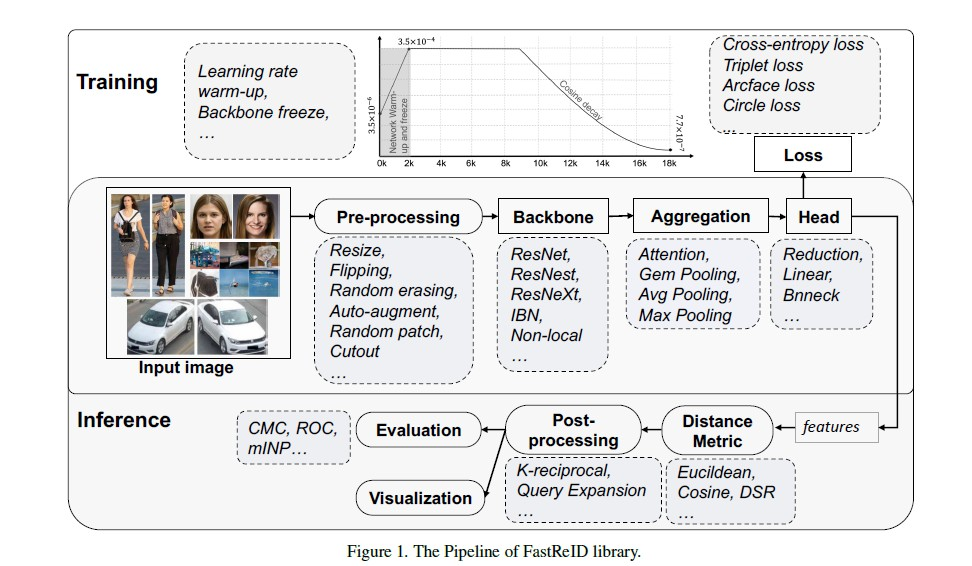

[TOC]

# 简介

- 来自京东AI实验室
- <a href = "https://github.com/JDAI-CV/fast-reid">Github地址</a>

- 跨域人员识别，部分人员识别和车辆识别

# FastReID的几个优势

- **模块化并且可拓展**，使得使用者可以插入定制的函数到重识别系统的几乎任何部分
- **可管理的系统配置**，FastReID支持许多可选择的组件，如骨干网络，头聚合层，损失函数和训练策略
- **更丰富的的评估系统**，如ROC和mINP

- **工程部署方便**，由于推理时间消耗和无法理解的层，太深的网络部署到边缘计算的硬件和人工智能芯片是什么困难的。FastReID完成了知识精馏函数来获得一个更加精简和高效的轻量级模型。并且FastReID提供了转换工具，如PyTorch->Caffe、PyTorch->TensorRT
- **最高水准的预训练模型**，FastReID提供了最高水准的推理模型，包括re-id，partial re-id，cross-domain re-id和vehicle re-id。

# FastReID的架构

## Image Pre-processing

- Resize the images to fixed-size images

- 将调整好大小的图片打包成batchers，然后输入到网络

- 为了获得鲁棒性更好的模型，使用的数据增强方法：flipping、**Random erasing、Random patch、Random patch、 Cutout、Auto-augment**

  - Random erasing：在图片中随机旋转一个矩形的区域，用随机值擦除她的像素
  - Random patch ：在图片中随机旋转一个矩形的区域，补上图片中另一个随机矩形的区域
  - Cutout：在图片中随机旋转一个矩形的区域，补上0值
  - **Auto-augment**：基于automl技术，采用自动搜索算法来寻找平移、旋转和剪切等图像处理函数的融合策略

## Backbone

- FastReID实现了三种不同的骨干网络，ResNet、ResNeXt、ResNeSt。
- 在骨干网络中增加了attention-like non-local 模块和 IBN（instance batch normalization）模块来得到健壮的特征

## Aggregation

- 聚集层的目的是把骨干网络生成的特征图聚集成一个全局特征。

- 四种聚集方法：

  - max pooling、average pooling、GeM Pooling 和 attention pooling
  - 池化层的输入：$ X \in R^{W \times H \times C} $ ,  $W ,H ,C$ 分别是特征图的宽、高和通道
  - 池化层的输出：$f \in R^{1 \times 1 \times C}$ ，全局向量$ f = [f_1,\dots,f_c,\dots,f_C]$ 
  - $\alpha$ 是一个控制系数，$W_c$ 是softmax注意权重

  

$$
Max Pooling: f_c = \max \limits_{x \in X_c} \ x        \\
Avg Pooling: f_c = \frac{1}{|X_c|} \sum_{x \in X_c} x  \\
Gem Pooling: f_c = (\frac{1}{|X_c|} \sum_{x \in X_c} x^{\alpha})^{\frac{1}{\alpha}} \\
Attention Pooling: f_c = \frac{1}{|X_c * W_c|} \sum_{x \in X_c, w\in W_c} w * x
$$

## Head

