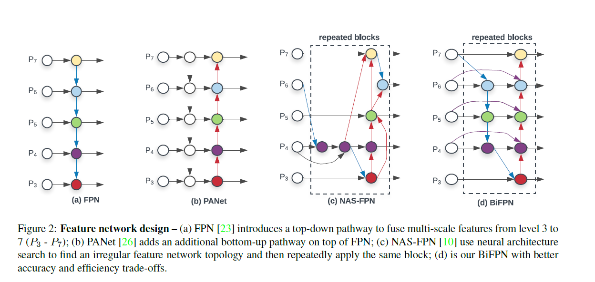
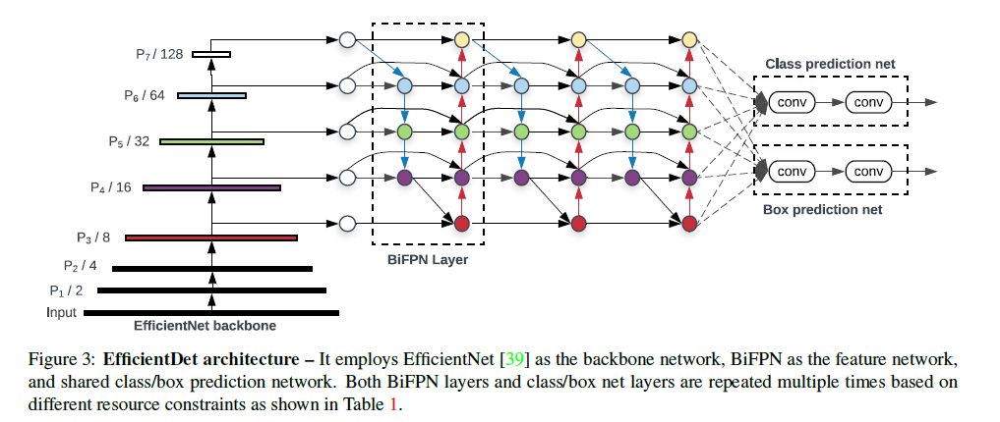
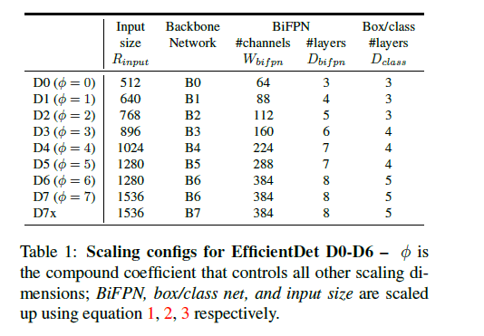

[TOC]

# Abstract

- first: propose a weighted bi-directional feature pyramid method(BIFPN)

- second: propose a compound scaling method that uniformly scales the resolution, depth, and width for all backbone,feature network, and box/class prediction networks at the same time.

# Introduction

## Two Challenges

### challenge 1

​	**efficient multi-scale feature fusion**(FPN has been widely used for muti-scale feature fusion)

​	While fusing different input features, **most previous** works simply **sum them up without distinction;** however, since these different input features are at different resolutions, we observe **they usually contribute to the fused output feature unequally.**

​	**propose a simple yet highly effective weighted bi-directional feature pyramid network(BiFPN)** to address this issue.

### challenge 2

​	**model scaling**

​	**previous works** mainly rely on bigger backbone networks or larger input image sizes for higher accuracy.

​	**Paper observe** : **scaling up(按比例缩放) feature network and box/class prediction network** is also critical when taking into account both accuracy and efficiency

​	Propose a compound scaling method for object detectors which jointly scales up the resolution/depth/width for all backbone, feature network,box/class prediction network.

# Related work

## BiFPN

### Problem Formulation

​	Formally，given a list of multi-scale features $\overrightarrow{P}^{in} = (P^{in}_{l_1}, p^{in}_{l_2},...)$, where $P^{in}_{l_i}$ represents the feature at level $l_i$ , our goal is to find a transformation f that can effectively aggregate different features and output a list of new features: $\overrightarrow{P}^{out} = f(\overrightarrow{P}^{in})$ 

​		In Figure2 , FPN takes level 3-7 input features $\overrightarrow{P}^{in} = (P^{in}_3,...,P^{in}_7)$  where **$P^{in}_i$ represents a feature level with resolution of $1/2^i$ of the input images.**

​			For instance, if input resolution is 640*640, the $P^{in}_3$ represents feature level 3 $640/2^3 = 80$ with resolution 80 * 80.The FPN aggregates muti-scale features in a top-down manner.
$$
P^{out}_7 = Conv(P^{in}_7) \\
P^{out}_6 = Conv(P^{in}_6 + Resize(P^{out}_7)) \\
... \\
P^{out}_3 = Conv(P^{in}_3 + Resize(P^{out}_4)) \\
$$
 	In the formulation, Resize is usually a **upsampling or downsampling op** for resolution matching, and Conv is usually a convolutional op for feature processing.

### Cross-Scale Connections

​		Paper propose serveral optimizations for cross-scale connections.

​		First: **remove those nodes that have one input edge**. **If a node has only one input edge with no feature fusion**, then it will have less contribution to feature network that aims at fusing different features.

​		Second, **add an extra edge** from the original input to output node if **they are the same level**, in order to fuse more features without adding much cost.

​	   Third, unlike PANet that only has one top-down and one bottom-up path, we **treat each bidirectional(top-down & bottom-up) path as one feature network layer**, and repeat the same layer multiple times to enable more high-level feature fusion.

### Weighted Feature Fusion

​	since different input features are at different resolutions ,they usually contribute to the output feature unequally.

​	**Add an additional weight for each input, and let the network to learn the importance of each input feature.**

**Three weighted fusion approaches:**

​	1. **Unbounded fusion** ： $O = \sum_{i} w_i \cdot I_i $ Where $W_i$ is a learnable weight that can be a scalar(per-feature), a vector(per-channel), or a multi-dimensional tensor(per-pixel).

​	Disadvantages: Since the scarlar weight is unbounded, it could potentially cause training instability.

​	Solution: resort to weight normalization to bound the value range of each weight.

​	2. **Softmax-based fusion:** $O = \sum_i \frac{e^{w_i}}{\sum_{j}e^{w_i}} \cdot I_i$  An intuitive idea is to **apply softmax to each weight**

​		Disadvantages: The extra softmax leads to significant slowdown on GPU hardware. 

​		Solution：To minimize the extra latency cost, we further propose a fast fusion approach.

​	3.**Fast normalized fusion**: $O = \sum_i \frac{w_i}{\varepsilon+ \sum_j W_j} \cdot I_i$ ,where $w_i \geq 0 $ is ensured by applying a Relu after each $W_i$ , and $\varepsilon = 0.0001$ is a small value to avoid numerical instability. 

​	The value of each normalized weight also falls between 0 and 1, but since there si no softmax operation here, it is much more efficient. 30% faster on GPUs

​	**BiFPN integrates both the bidirectional cross-scale connections and the fast normalized fusion.** 

​	 Example :
$$
P^{td}_6 = Conv(\frac{w_1 \cdot P^{in}_6 +w_2 \cdot Resize(P^{in}_7)}{w_1 + w_2+\varepsilon})
$$

$$
P^{out}_6 = Conv(
    \frac{ w^{'}_{1}  \cdot P^{in}_{6}
    + w^{'}_2 \cdot P^{td}_6 
    + w^{'}_3 \cdot Resize(P^{out}_5)
}
{
	w^{'}_1 + w^{'}_2 + w^{'}_3 + \varepsilon
})
$$

​	where $P^{td}_6$ is the intermediate feature at level 6 on the top-down pathway, and $P^{out}_6$ is the output feature at level 6 on the bottom-up pathway.

​	**Notably, to further improve the efficiency, we use depthwise separable convolution for feature fusion, and add batch normalization and activation after each convolution.**

# EfficientDet

## EfficientDet Architecture

​		

​		

## Compound Scaling

​	**Key Challenge:** how to scale up a baseline EfficientDet model.

​	**Solution**: Propose a new compound scaling method for object detection, which **uses a simple compoud coefficient $\phi$ to jointly scale up all dimensions of backbone**, BiFPN, class/box network, and resolution.object detectors have **much more scaling dimensions than image classification models**, so grid search for all dimensions is prohibitive expensive

​	**Backbone network:**	reuse the same width/depth scaling coefficients of EfficientNet-B0 to B6 such that we can easily reuse their ImageNet-pretrained checkpoints.

​	**BiFPN network:** l**inearly increase BiFPN depth** $D_{bifpn} $(#layers) since depth needs to be rounded to small integers.For BiFPN width $W_{bifpn}$ (#channels) , **exponentially grow BiFPN width** $W_{bifpn}$(#channels). Specifically, we perform a  grid search on a list of values{1.2, 1.25, 1.35, 1.4, 1.45}, and pick the best value as the BiFPN width scaling factor.
$$
W_{bifpn} = 65 \cdot (1.35^{\phi}),D_{bifpn}=3+\phi  \tag{1}
$$
​	**Box/class prediction network:** fix their width to be always the same as BiFPN ($W_{pred} = W_{bifpn}$), but linearly increase the depth(#layers) using equation:
$$
D_{box} = D_{class} = 3+\lfloor \phi /3 \rfloor \tag{2}
$$
​	**Input image resolution** Since feature level 3-7 are used in BiFPN, the input resolution must be dividable by $2^7 = 128$ , so we linearly increase resolutions using equation:
$$
R_{input} = 512 + \phi \cdot 128 \tag{3}
$$
  	Following Equations 1,2,3 with different $\phi$ ,we have developed EfficientDet-D0 ($\phi =0$) to D7($\phi=7$) 

