[TOC]

- [参考](https://blog.csdn.net/stalbo/article/details/79283399)

# abstract

- 生成对抗网络
- model G ：生成一些样本
- model D : 判断样本是否是真样本

G是一个生成器，结构为一个多层感知机，参数为 $\theta_g$, $G(z;\theta_g)$ 为生成映射函数，将噪音z映射到新的数据空间。D是判别器，也是一个多层感知机，参数为$\theta_d$ , $D(x;\theta_d)$ 输出为一个标量，表示x来自真实数据data而不是生成数据的概率

> $p_{data}$ 真实数据的分布
>
> $p_z$ 原始噪音的分布
>
> $p_g$ 经过生成器后的数据分布

# adversarial net

目标函数：
$$
\min\limits_{G} \max\limits_{D}(D,G) 
= E_{x \sim p_{data}(x)} [\log D(x)] + E_{x \sim p_{z}(z)}[\log(1 - D(G(z)))]
$$
对于判别器D来说，它的目标是更加准确地区分出真实数据和生成数据，即D(x)要尽可能地大，而D(G(z))要尽可能地小；而对于生成器G来说，他的目标是最小化生成数据和真实数据之间的差别，即D(G(z))要尽可能大

在训练中，我们把训练G问题改成了 maximize $\log D(G(z))$ ，这个改变使得G和D在早期变得更强。

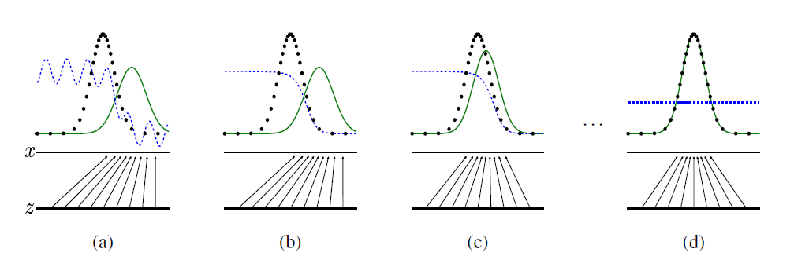

图中，黑色曲线是真实数据的概率分布，绿色曲线是生成器G所生成的样本的分布，蓝色曲线是D的输出，它的值越大表示这个样本越有可能是真实样本，最下方的平行线是噪声z，它映射到了x。

从图中可以看出，系统的目标是将绿色曲线即生成器G的样本分布逐步拟合到真实数据的分布，使得D无法区分，即输出对任意样本都是0.5

# KL散度

KL散度用于计算两种概率分布的相似程度，其越小，则两种概率分布越近

离散的概率分布:
$$
D_{KL}(P||Q) = \sum \limits_{i} P(i)\log \frac{P(i)}{Q(i)} 
$$
连续的概率分布：
$$
D_{KL}(P||Q) = \int ^{\infty}_{\infty} P(x) \log \frac{P(x)}{Q(x)} dx
$$
我们想要将一个随即高斯噪声z通过一个生成网络G得到一个和真的数据分布$P_{data}(x)$差不多的生成分布$P_G(x;\theta)$,其中的参数$\theta$ 是网络的参数决定的，我们希望找到$\theta$ 使得$P_{G}(x;\theta) 和 P_{data}(x)$ 尽可能接近

# JS散度

# Maximun Likelihood Estimation

我们从真实数据分布$P_{data}(x)$ 里面取样m个点，$x^1, x^2,..., x^m$,根据已经给定的参数$\theta$ 我们可以计算如下的概率$P_{G}(x^i; \theta)$ ，那么生成这m个样本数据的似然（likelihood）就是：
$$
L = \prod \limits^{m}_{i=1} P_{G}(x^i; \theta)
$$
我们要做的就是找到$\theta^*$ 来最大化这个似然估计

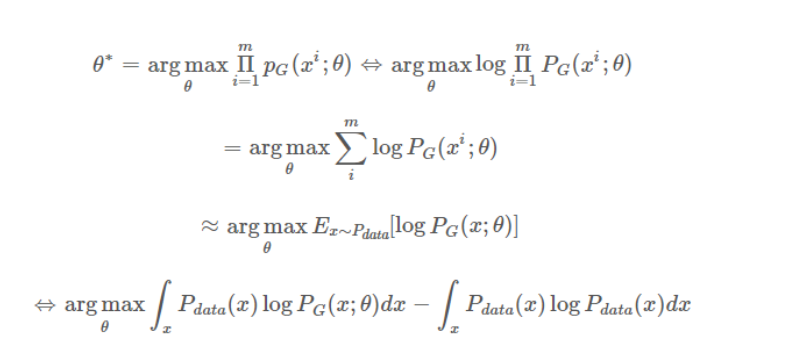

在上面的推导中，我们希望最大化似然函数$L$。 若对似然函数取对数，那么累乘$\prod$就能转化为累加，并且这一过程不会改变最优化的结果，因此可以把最大化似然估计转化为求令$\log P_{G}(x;\theta)$ 期望最大化的$\theta$，而期望$E\log P_{G}(x;\theta)$ 可以展开为在x上的几分形式: $\int P_{data}(x)\log P_{G}(x;\theta) dx$

又因为该最优化过程是针对$\theta$ 的，所以我们添加一项不含$\theta$ 的积分不影响最优化效果，即可添加$\int P_{data}(x)\log P_{data}(x)dx$ 添加该积分后，我们可以合并这两个积分，并构建类似KL散度的形式

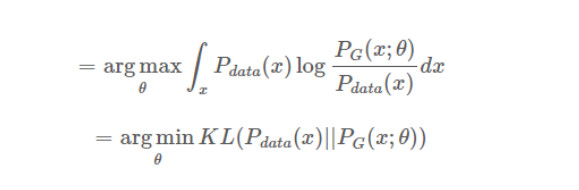

这里再前面添加一个符号，将log里面的分数颠倒一下，就变成了KL散度

而$P_{G}(x; \theta)$ 如何算出来呢？
$$
P_{G}(x) = \int_{z}P_{prior}(z) I_{|G(z)=x|}dz
$$
里面的I表示示性函数，也就是：
$$
I_{G(z)x} = \begin{cases}
0 & G(z) \neq x 
\\
1 & G(z) =x
\end{cases}
$$
其实根本没法把这个$P_{G}(x)$求出来

# Global Optimality of Pg = Pdata

- 生成器 G：
  G 是一个生成器，给定先验分布 Pprior(z) 我们希望得到生成分布 PG(x)，这里很难通过极大似然估计得到结果。
- 判别器 D：
  D 是一个函数，来衡量 PG(x)与 Pdata(x) 之间的差距，这是用来取代极大似然估计

最优的D是：
$$
D^*_G(x) = \frac{P_{data}(x)}{P_{data}(x)+P_g(x)}
$$
在极大极小博弈中的第一步中，给定生成器G，最大化V(D,G)而得出最优判别器D。其中最大化V(D,G)评估了$P_G$和$P_{data}$ 之间的差异或距离。

.png)

在数据给定，G给定的前提下，$P_{data}$与$P_{G}(x)$ 都可以看作是常数，我们可以分别用a，b来表示他们

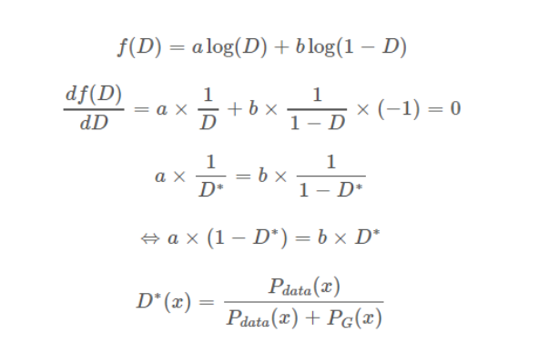

# optimal generative

GAN过程的目标是令$P_{G} = P_{data}$ 

代入 $D^*(x)$ 中, 则$D^*_G = \frac{1}{2}$ ,之所以$P_G = P_{data}$ 可以令价值函数最小化，是因为这时候两个分布的js散度 $JSD(P_{data}(x) ||P_{G}(x))$ 等于0

原论文中的这一定理是「当且仅当」声明，所以我们需要从两个方向证明。首先我们先从反向逼近并证明 C(G)的取值，然后再利用由反向获得的新知识从正向证明。设 PG=Pdata（反向指预先知道最优条件并做推导），我们可以反向推出：
$$
\begin{eqnarray}

V(G,D^*_G) &=& \int_x P_{data}(x)\log\frac{1}{2} +P_G(x)\log(1-\frac{1}{2}) dx
\\
&=& -\log2\int_x P_{data}(x) - \log2\int_x P_G(x) dx
\\
&=& -2\log2
\\
&=&-\log4
\end{eqnarray}
$$
该值是全局最小值的候选，因为它只有在 PG=Pdata 的时候才出现。我们现在需要从正向证明这一个值常常为最小值，也就是同时满足「当」和「仅当」的条件。现在放弃 PG=Pdata的假设，对任意一个 G，我们可以将上一步求出的最优判别器 $D^*$ 代入到 C(G)=maxV(G,D) 中：

因为已知 -log4 为全局最小候选值，所以我们希望构造某个值以使方程式中出现 log2。因此我们可以在每个积分中加上或减去 log2，并乘上概率密度。这是一个十分常见并且不会改变等式的数学证明技巧，因为本质上我们只是在方程加上了 0。

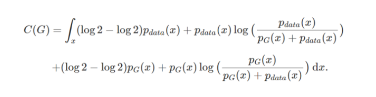

采用该技巧主要是希望能够构建成含 log2 和 JS 散度的形式，上式化简后可以得到以下表达式：

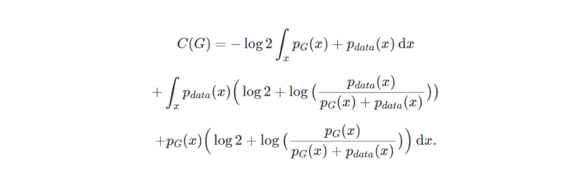

因为概率密度的定义，PG 和 Pdata 在它们积分域上的积分等于 1，即：

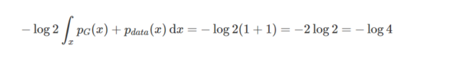

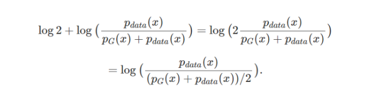

现在，如果读者阅读了前文的 KL 散度，那么我们就会发现每一个积分正好就是它。具体来说：

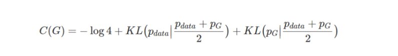

KL 散度是非负的，所以我们马上就能看出来 -log4 为 C(G)的全局最小值。

如果我们进一步证明只有一个 G 能达到这一个值，因为 PG=Pdata将会成为令 C(G)=−log4 的唯一点，所以整个证明就能完成了。

JS 散度的取值为 0 到 log2。若两个分布完全没有交集，那么 JS 散度取最大值 log2；若两个分布完全一样，那么 JS 散度取最小值 0。

因此 C(G)可以根据 JS 散度的定义改写为：

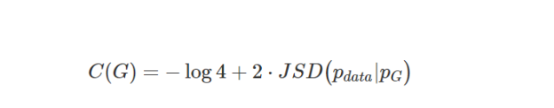

# training

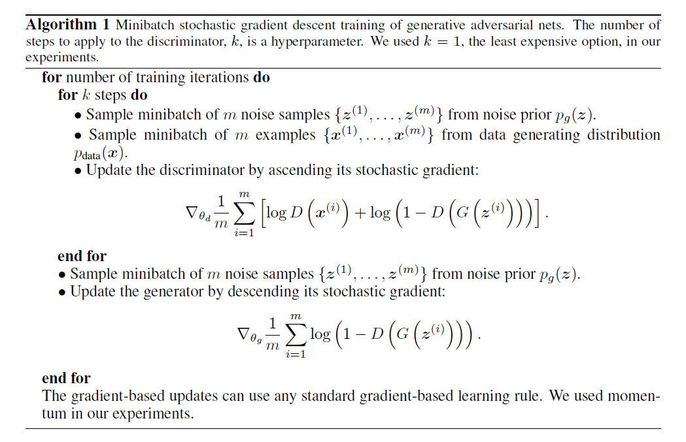