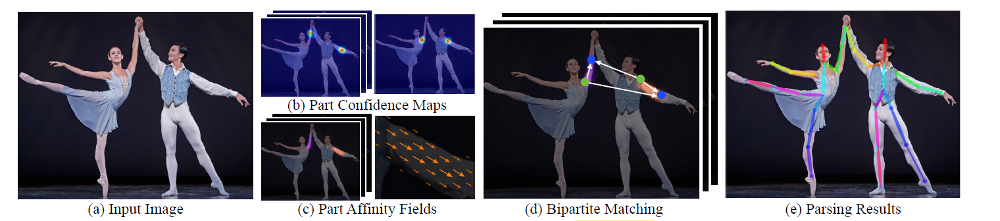
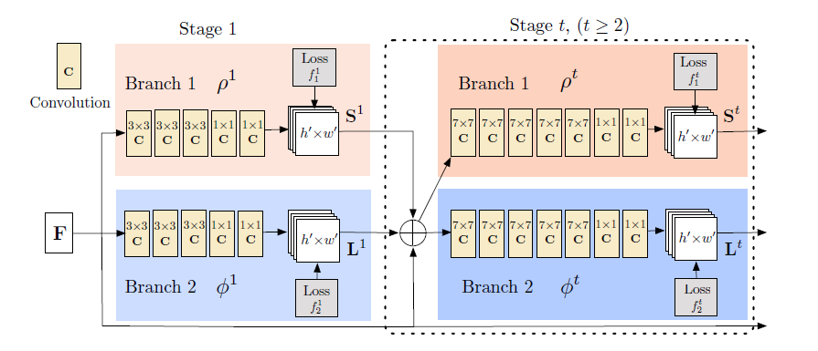
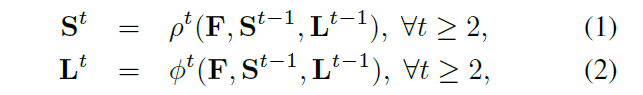
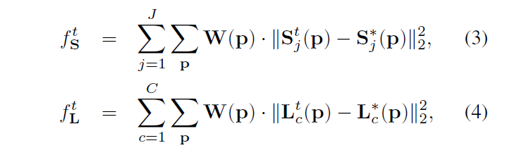
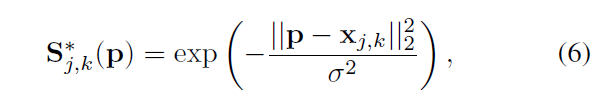
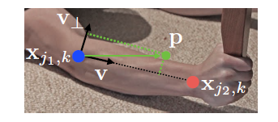
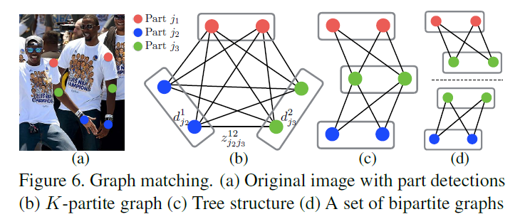

[TOC]

# Introduction

## tradition

　    传统的自顶向下的姿态估计算法都是采用先定位到人，再做单人关键点检测。这种方法的缺点在于：

　　图像中人的数量、位置、尺度大小都是未知的，人与人之间的交互遮挡可能会影响检测效果，最最重要的是，运行时间复杂度随着图像中个体数量的增加而增长，无法实时检测。

​	如果无法成功定位到人，则无法进行关键点检测。

## now

将整张图片作为输入到一个两个分支的CNN来同时预测关于身体部分检测的confidence map 和关于身体各部分联系的part affinity fields。

解析步骤展示了二部图匹配来关联候选主体部分，我们最后聚合他们来形成一个完整的身体姿势。

# Method

## output

- $S=(S_1,S_2..,S_J)$ 有J个confidence maps，一个部分一个$S_j \in R^{W \times h}, j \in\{1...J\}$
- $L=(L_1, L_2,...,L_C)$有C个向量场，一个肢体各一个，$L_c \in R^{W \times h \times 2}, c \in \{1...C\}$

## architecture

- **network**

分支一：预测confidence maps

分支二：预测PAFs

在每一个步骤之后，两个分支的输出和图像特征**F**(用CNN进行提取，以VGG-19的前十层进行初始化和微调)concat在一起，输入到下一个stage

- **loss**

  

 $S_j^*$是confidence map的真实值， $L_C^*$ 是part affinity vector field的真实值。Ｗ是权重，为了防止原图中有未标注的关键点或肢体，在位置ｐ处若没有标注，则将Ｗ（ｐ）置为０，否则为１。最终将各个loss相加。

- **PCM**

  关节点置信图$S_{j,k}^*(p)$，**表示第k个人的第j个关节点存在于p像素的置信度**。计算公式如下：

  - $X_{j,k}$ : 第k个人的第j个关节点
  - sigma：高斯分布扩散程度
  - 在关节点上的像素的置信度为1，其周围像素点根据距离呈高斯分布扩散，距离越远，置信度越低；距离越近，置信度越高。

如果一个像素点存在多个响应,意味这一张图中有多个人，见下图。

上图表示j关节点的置信图，2条高斯曲线表示像素p对2个人j关节的响应，出现这种情况时，我们取最大响应值，即图中的虚线。

因此，单个像素只对一个人的关节产生响应，**最终，一张图对应的PCM为**$S_J^*(p)$,其维度为**$W \times H \times J$**

- **PAF**

  

$X_{j_1,k}和X_{j_2,k}$ 是指第k个人的肢体c的ground truth的身体部位$j_1和 j_2$
$$
L_{c,k}^*(p) = \begin{cases}
v & \text{if p on limb c,k}
\\
0 & \text{otherwise.}
\end{cases} 
\tag{1}
$$

$$
v =(X_{j_2,k} - X_{j_1,k})/||{X_{j_2,k}-X_{j_1,k}}||_2   \tag{2}
$$

$$
0 \leq v \cdot(p-x_{j_1,k}) \leq l_{c,k}
\ \ and \ \
|V_{\bot} \cdot(p-X_{j_1,k})| \leq \sigma_{l}
\tag{3}
$$

$$
l_{c,k} = ||{X_{j_2,k} -X_{j_1,k}}||_2  \tag{4}
$$

$$
L^*_{c}(p) =\frac{1}{n_c(p)} \sum_{k} L^*_{c,k}(p) \tag{5}
$$

$L_{c,k}^*(P)$ 是指第k个人的第c个肢体向量场上p点的向量。由公式1可以看出点p在第k个人的肢体c的范围内时，则$L_{c,k}^*(P)=v$ 。由公式3进行判断p是否落在肢体c的区域内，$V_{\bot}$是垂直V的单位向量，$l_{c,k}$是由公式4计算获得，也就是$X_{j_2,k}和X_{j_1,k}$ 的距离；$\sigma_{l}$ 是指肢体c的宽度。当p点没有在肢体上，$L^*_{c,k}(P)=0$ ,当n个人在点p的 $L^*_{c,k}(P)$的值都不为0，则由公式5计算他们的平均值。

测试时，沿着候选点的连接线段，通过计算PAF的线性积分来测量候选点之间的关系
$$
E = \int_{u=0}^{u=1} L_{c}(p(u)) \cdot \frac{d_{j_2} - d_{j_1}}{||{d_{j_2} - d_{j_1}}||_2}du \tag{1}
$$

$$
p(u) = (1-u)d_{j_1} + ud_{j_2} \tag{2}
$$

E是指$L_c$ 沿着预测点$d_{j_1}和d_{j_2}$两点之间的线段计算出来的两点之间关系的置信度，也就是两点之间线段的权重。

由公式2 可以得知，p(u)的取值范围在$d_{j_1}到d_{j_2}$

- **Muti-People-PAFs**

  

  　　对检测出来的置信度图执行非极大值抑制，获得离散的关键点位置候选集。由于图中有多人，对于每种关键点，有若干候选。因此有很多可能的肢体，如图6b所示。通过计算PAF上的线积分（公式10）评估每一个候选肢体的置信度。找到最优肢体是一个NP问题，在本文中使用一个贪心松弛策略（匈牙利算法？），使得每次都能产生高质量的匹配，其根据是：*由于PAF网络的大感知场，成对关联分数隐含地编码了全局上下文（下文蓝字体）*。

  　　首先，得到一系列关键点候选（整张图像多个人），记为Dj={}，表示关节j的图中第m个候选关键点。这些关键点候选需要跟同一个人的其他关键点进行关联，找到关键点的成对关系，即肢体。定义变量={0或1}表示关键点候选和是否关联。算法目标：找到所有最佳关联，记为Z。
  $$
  Z =\{ 
  z^{mn}_{j_1j_2}: for \ \ 
  j_1,j_2 \in \{1...J\},
  m \in \{1...N_{j_1}\},
  n \in\{1...N_{j_2} \}
  \}
  $$

　　考虑一对关键点j1,j2(例如脖子，右臀)组成肢体**c**，找到最佳匹配，是最大权重二分图匹配问题：节点是候选集Dj，边的权值由公式10计算，二分图匹配选择最大权重的边（匹配就是从边中选子集），使得没有边共享节点（由公式13-14强制要求，没有同类肢体共享一个关键点，比如一个脖子只连接一个右臀）。找最佳二分图匹配使用匈牙利算法。
$$
\max_{Z_c} = \max_{Z_c} 
\sum_{m \in D_{j_1}}
\sum_{n\in D_{j_2}} E_{mn}\cdot z^{mn}_{j_1,j_2}
\\
\forall	m\in D_{j_1}, \sum_{n\in D_{j_2}} z^{mn}_{j_1j_2} \leq1
\\
\forall	n\in D_{j_2}, \sum_{m\in D_{j_1}} z^{mn}_{j_1j_2} \leq1
$$
　　当找到多人的全身姿势时，确定出Z是NP Hard问题并且存在许多优化之处。专门针对这个领域，该论文有两个优化策略：1.选择边的最小数目，来构造人体姿态骨架，而不使用完全图，如图6c（只需要考虑有关系的两种关键点，对于单个人的骨架而言是一个生成树）2.将这个匹配问题进一步分解成一个个的子问题，独立地确定相邻树节点的匹配，如图6d。（其实这两个策略是递进地解决了该问题）。在3.1节展示了详细的比较结果，证明最小贪心推理可以近似全局最优解，而计算消耗却大大减少。原因在于相邻树节点之间的关系由PAF明确建模，在内部，非相邻节点之间的关系由CNN隐式建模。此属性的出现是因为：使用大型感知场训练CNN网络，而非相邻树节点的PAFs也影响预测的PAF。（？使用CNN，预测出的PAFs包含了所有点对的信息？）

通过这两个松弛策略，该优化目标为：
$$
\max_{Z} E = \sum_{c=1}^{c}\max_{Z_c} E_c
$$
因此，我们独立地使用公式12-14获得每种肢体类型的肢体候选。通过所有肢体连接候选，将共享相同关键点的不同肢体组装成人的全身骨架姿态。树结构上的优化方案比完全连通图上的优化要快很多。