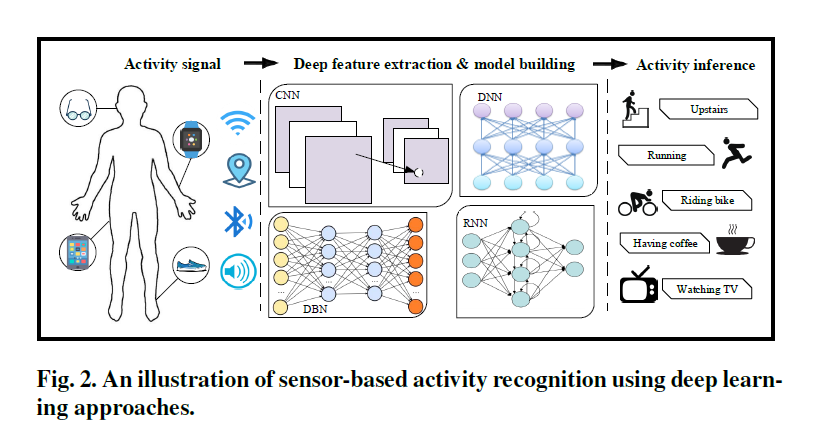

[TOC]

# abstract

- 文章主要说明cnn在传感器中的应用，而传统的方法非常依赖启发式手工特征提取。
- 文章包含三方面：sensor modality、deep model 、application

# HAR(Huamn activity recognition)

HAR能够从原始的传感器输入中学习到有关人类活动的高深知识。

成功的HAR应用包括了：

- behavior analysis
- video surveillance
- gait analysis
- gesture recognition

----------------------

# How to solve the problem?

## conventional

HAR可以被当成一个典型的模式识别问题(Pattern recognition),用在HAR上的传统的模式识别方法包括：

- decision tree
- suppor vector machine
- naive Bayes
- hidden Markov models

但是这些方法非常依赖前期的手工式特征提取，这就受到人知识领域的限制。

## some concept

HAR 的目标是理解人的行为，这样才能够让计算系统在人需要的时候做出相应的帮助。

假设人的行为集为A,m代表的是行为的种类：
$$
A = \{ A_i \} ^m_{i=1}
$$
而传感器捕获到人的行为信息序列为, $d_t$ 代表了在时间t所获得的行为信息：
$$
s = \{ d_1, d_2, ..., d_t ,..., d_n \}
$$
而我们的目标是获得一个模型 $F$
$$
\hat{A} = \{ \hat{A_j} \}^m_{j=1} = F(s), \ \ \hat{A_j} \in A
$$
而真实值为
$$
A^{*} =  \{ A^*_j\}^n_{j=1} , \ \ A^*_j \in A
$$
$n \geq m$

HAR 的目标是通过最小化预测值和真实值之间的差距来学习模型$\mathcal F$  , 即 $\mathcal L(\mathcal F(s), A^*)$ ,但是**模型并不是把s直接作为输入**，中间会有一个连接函数 $\phi$ 来转行传感器的数据 $d_i \in s$ 到一个d-dimensional 特征的向量 $\phi(d_i) \in R^d$ ，因此loss变为 $\mathcal L(F(\phi(d_i)), A^*)$ 。通常，传统的方法的特征提取通过均值、方差、DC、振幅这些来完成任务。

## sensor

- 传感器形式主要分为body-worn sensors、  object sensors 、ambient sensors
  - Body-worn Sensor:这些传感器通常被用户佩戴，比如加速度计、磁强计和陀螺仪。这些传感器通常被用来挖掘并识别人的日常生活
  - Object sensor : 用于检测某一特定物体的运动，以推断人类活动，如RFID（Radio frequency identifier）被用于智能家庭环境和医学活动。RFID可以为更复杂的活动识别提供更细粒度的信息
  - ambient sensor ：用于捕捉人与环境之间的相互作用，有radar，sound sensors、pressure sensors、temperature sensors
  - hybrid sensor: 混合不同的传感器来达成任务。

| Modality  | Description | Examples |
| ---- | -------- | -------- |
| Body-worn | Worn by the user to describe the body movements | Smartphone, watch, or band’s accelerometer, gyroscope etc |
| Object    | Attached to objects to capture objects movements | RFID, accelerometer on cup etc. |
| Ambient   | Applied in environment to reflect user interaction | Sound, door sensor, WiFi, Bluetooth etc |
| Hybrid | Crossing sensor boundary | Combination of types, often deployed in smart environments |

## deep learning

传统的学习方法可以学习到一些low-level的行为如走路、奔跑；但是对于一些high-level的行为，如喝咖啡就没辙了。并且，传统的方法经常需要大量高质量的labeled数据来训练模型，而deeplearning可以挖掘unlabelled样本来进行训练。

**卷积神经网络(**ConvNets，或CNN)利用了三个重要的思想:稀疏交互、参数共享和等变表示，卷积后的层通常是池层和全连通层，它们执行分类或回归任务。

**CNN的优点：**

- 局部依赖性（local dependency）: 指邻近信号可能是相关的
- 尺度不变性（scale invariance）:不同步距或不同频率下的尺度不变性。

## how to tranform the data to adapt the cnn

- **data-driven**

  data-driven吧每一个纬度当成一个channel，然后在他们身上用1维的卷积。[1维卷积](https://www.jianshu.com/p/7eb0fa5517c0)

  

然后分别进行卷积和池化，或者利用同一时间窗的一维卷积来统一和共享多传感器CNN的权值。这种数据驱动的方法将一维传感器读数视为一维图像，简单且易于实现。但是这种方法忽略了尺寸和传感器之间的关系，这可能影响到模型的表现。

- **model-driven** 

  模型驱动方法将输入值调整为虚拟的二维图像，从而采用二维卷积。[如何将时间序列转化为图片](https://blog.csdn.net/weixin_39679367/article/details/86416439)

- **weight-sharing**（[百度百科]([https://baike.baidu.com/item/%E6%9D%83%E5%80%BC%E5%85%B1%E4%BA%AB/22689640](https://baike.baidu.com/item/权值共享/22689640))）

权值共享意味着每一个过滤器在遍历整个图像的时候，过滤器的参数(即过滤器的参数的值)是固定不变的，比如我有3个特征过滤器，每个过滤器都会扫描整个图像，在扫描的过程中，过滤器的参数值是固定不变的，即整个图像的所有元素都“共享”了相同的权值。

## Autoencoder

- [参考](https://zhuanlan.zhihu.com/p/68903857)

​	AutoEncoder框架的基本思想，如下图所示。AutoEncoder框架包含两大模块：编码过程和解码过程。通过encoder（g）将输入样本x映射到特征空间z，即编码过程；然后再通过decoder（f）将抽象特征z映射回原始空间得到重构样本x'，即解码过程。优化目标则是通过最小化重构误差来同时优化encoder和decoder，从而学习得到针对样本输入x的抽象特征表示z。

AutoEncoder在优化过程中无需使用样本的label，本质上是把样本的输入同时作为神经网络的输入和输出，通过最小化重构误差希望学习到样本的抽象特征表示z。这种无监督的优化方式大大提升了模型的通用性。

对于基于神经网络的AutoEncoder模型来说，则是encoder部分通过逐层降低神经元个数来对数据进行压缩；decoder部分基于数据的抽象表示逐层提升神经元数量，最终实现对输入样本的重构。

由于AutoEncoder通过神经网络来学习每个样本的唯一抽象表示，这会带来一个问题：当神经网络的参数复杂到一定程度时AutoEncoder很容易存在过拟合的风险。

## Stacked Autoencoder （SAE）

- [参考](https://www.cnblogs.com/huangyc/p/9839493.html)

堆栈自动编码器(SAE)也叫深度自动编码器DeepAutoEncoder,从命名上也很容易理解,SAE就是在简单自动编码器的基础上,增加其隐藏层的深度,以获得更好的特征提取能力和训练效果.