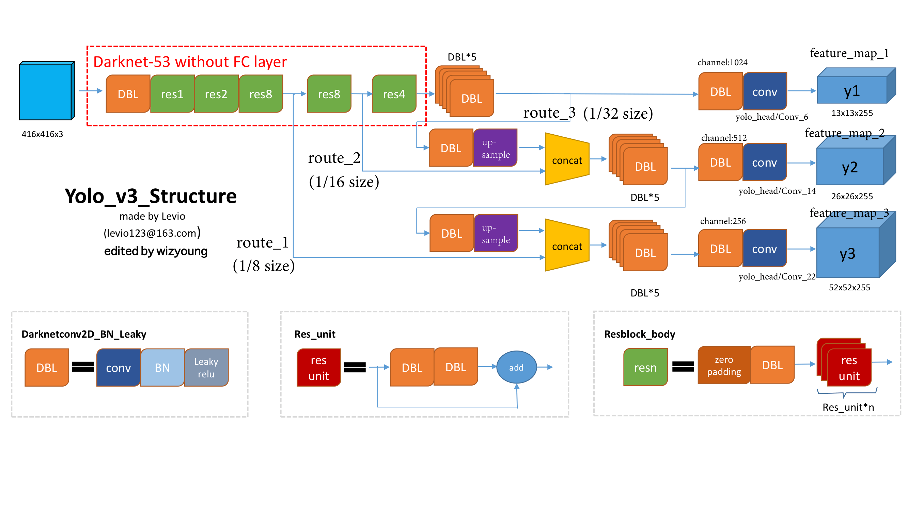
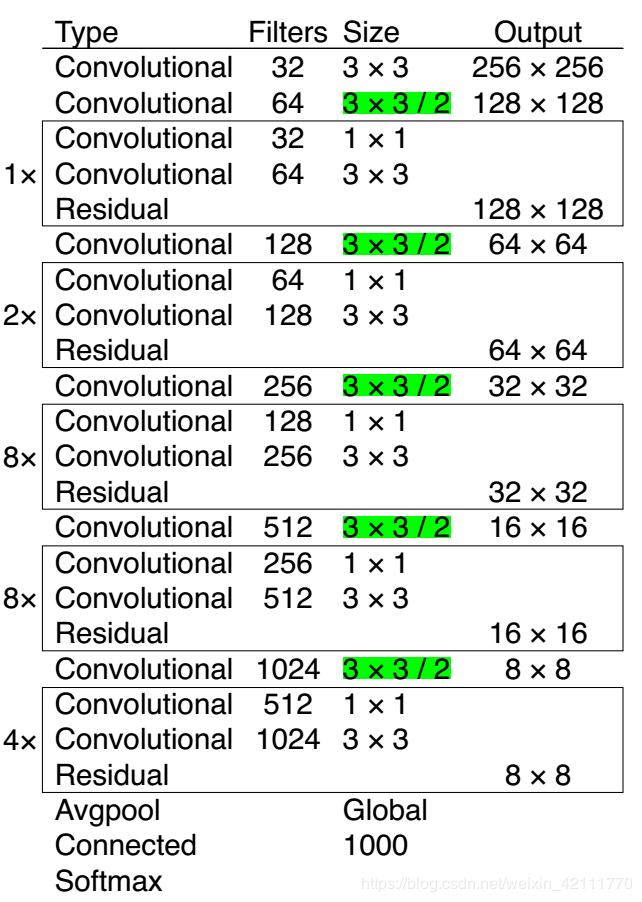

# yolov3

- [参考1](https://zhuanlan.zhihu.com/p/76802514)
- [参考2](https://blog.csdn.net/weixin_42111770/article/details/88092742)

## change

- **Class Prediction ：** 只使用 logistics 分离器，在训练的时候只使用二分类的 cross-entropy loss，这是因为softmax假设了一个物体只有一个label，而物体可能有多个类别，这意味着yolov3变成了多目标预测
- **Predictions Across Scales：**
  -  YOLO v3是在3个不同尺寸的特征图上进行预测的，如果输入图像大小为$416 \times 416$，那么特征图大小分别为$13*13, 26*26, 52*52$。在一个特征图上的每一个网格预测3个box，每个盒子需要(x, y, w, h, confidence)五个基本参数，并对每个类别输出一个概率，设特征图大小为N，对于COCO数据集，则每一个特征图需要预测$ N*N*[3 *(4+1+80)] = N*N*255$，，所以每一个特征图的通道数为255。上述的Darknet-53网络是最base net，v2版本中，为了细粒度检测，添加了passthrough layer，在v3中，因为有3种特征图，base net只能输出一种尺寸的特征图，为了得到另外两种尺寸的特征图，对前两层的特征图进行上采样，之后将上采样后的特征图和之前的特征图进行连接

- **darknet**： 去掉了池化层，是在五个卷积上定义步长为2来下采样，总步长为32。

