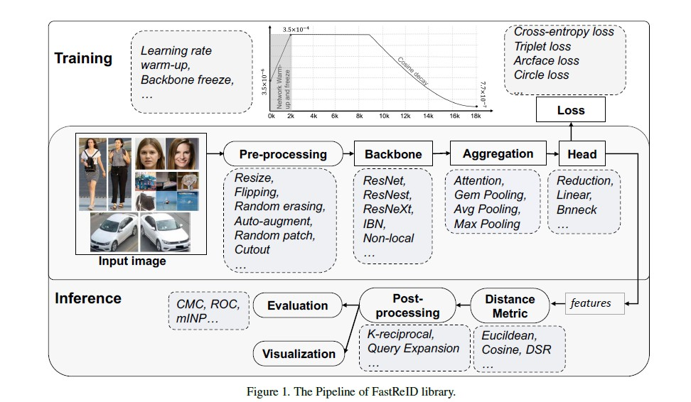

[TOC]

# 简介

- 来自京东AI实验室
- <a href = "https://github.com/JDAI-CV/fast-reid">Github地址</a>

- 跨域人员识别，部分人员识别和车辆识别

# FastReID的几个优势

- **模块化并且可拓展**，使得使用者可以插入定制的函数到重识别系统的几乎任何部分
- **可管理的系统配置**，FastReID支持许多可选择的组件，如骨干网络，头聚合层，损失函数和训练策略
- **更丰富的的评估系统**，如ROC和mINP

- **工程部署方便**，由于推理时间消耗和无法理解的层，太深的网络部署到边缘计算的硬件和人工智能芯片是什么困难的。FastReID完成了知识精馏函数来获得一个更加精简和高效的轻量级模型。并且FastReID提供了转换工具，如PyTorch->Caffe、PyTorch->TensorRT
- **最高水准的预训练模型**，FastReID提供了最高水准的推理模型，包括re-id，partial re-id，cross-domain re-id和vehicle re-id。

# FastReID的架构

## Image Pre-processing

- Resize the images to fixed-size images

- 将调整好大小的图片打包成batchers，然后输入到网络

- 为了获得鲁棒性更好的模型，使用的数据增强方法：flipping、**Random erasing、Random patch、Random patch、 Cutout、Auto-augment**

  - Random erasing：在图片中随机旋转一个矩形的区域，用随机值擦除她的像素
  - Random patch ：在图片中随机旋转一个矩形的区域，补上图片中另一个随机矩形的区域
  - Cutout：在图片中随机旋转一个矩形的区域，补上0值
  - **Auto-augment**：基于automl技术，采用自动搜索算法来寻找平移、旋转和剪切等图像处理函数的融合策略

## Backbone

- FastReID实现了三种不同的骨干网络，ResNet、ResNeXt、ResNeSt。
- 在骨干网络中增加了attention-like non-local 模块和 IBN（instance batch normalization）模块来得到健壮的特征

## Aggregation

- 聚集层的目的是把骨干网络生成的特征图聚集成一个全局特征。

- 四种聚集方法：

  - max pooling、average pooling、GeM Pooling 和 attention pooling
  - 池化层的输入：$ X \in R^{W \times H \times C} $ ,  $W ,H ,C$ 分别是特征图的宽、高和通道
  - 池化层的输出：$f \in R^{1 \times 1 \times C}$ ，全局向量$ f = [f_1,\dots,f_c,\dots,f_C]$ 
  - $\alpha$ 是一个控制系数，$W_c$ 是softmax注意权重

  

$$
Max Pooling: f_c = \max \limits_{x \in X_c} \ x        \\
Avg Pooling: f_c = \frac{1}{|X_c|} \sum_{x \in X_c} x  \\
Gem Pooling: f_c = (\frac{1}{|X_c|} \sum_{x \in X_c} x^{\alpha})^{\frac{1}{\alpha}} \\
Attention Pooling: f_c = \frac{1}{|X_c * W_c|} \sum_{x \in X_c, w\in W_c} w * x
$$

## Head

- Head是处理聚合模块生成的全局向量的部分，包含：

  - batch normalization head ：a bn layer and a decision layer
  - Linear head：a decision layer
  - Reduction head：conv+bn+relu+dropout operation、a reduction layer and a decision layer

  

- **Batch Normalization** 

  - 用于解决内部协变量偏移，这是由于训练一个带有饱和非线性的模型是非常困难的。

  - Given a batch of feature vector  $f \in R^{m \times C}$ (**m** is the sample number in a batch), then the bn feature  $f_{bn} \in R^{m \times C}$ can be computed as :
    $$
    \begin{cases}
    
    \ \  \mu  = \frac{1}{m} \sum_{i=1}^{m}f_i, 
    \\ \\ \\
    			
    \    \sigma^{2}  = \frac{1}{m} \sum_{i=1}^{m}(f_i - \mu)^2,&(5) 
    \\ \\ \\
    	 				
      f_{bn} = \gamma \cdot \frac{f - \mu}{\sqrt{\sigma^2 + \varepsilon}} + \beta
    \end{cases}
    $$

  - $ \gamma$ 和 $\beta$ 是训练范围和偏移参数，而 $\varepsilon$ 是一个常量，使得被除数不为0

- **Reduction layer** 
  
  - 使得高纬度的特征变成低纬度特征， 2048-dim -> 512-dim
- **Decision layer** 
  
  - 输出不同类别的概率来区分不同类别，用于接下来的模型训练。

# Training

## Loss Function

- 四个不同的loss function 在FastReID中被使用

- **Cross-entropy loss** 
  $$
  \mathcal L_{ce} = \sum^{C}_{i=1} y_i \log \hat{y} + (1 - y_i) log(1-\hat{y_i}) \ \ （6） 
  $$
  

  - 其中$\hat{y_i} = \frac{e^{W^T_if}}{\sum^C_{i=1}e^{W^T_if}} $ 

- **Arcface loss** 
  - 将笛卡尔坐标映射到球面坐标
  - 转化logit的方式：$W^{T}_if = ||W_i|| \  ||f|| \cos \theta_i $ ，$\theta_i$ 是weight $W_i$ 和 feature $f$ 之间的角度。
  - 通过 $l_2$ normalisation固定了 individual weight $||W_i|| = 1$ ， 和通过12 normalisation固定 embedding feature $f$ 并且把它重新调整到 s，所以 $\hat{y_i} = \frac{e^{s\cos \theta_i}}{\sum^{C}_{i=1}e^{s \cos \theta_i}}$ 。
  - 为了同时增强类内紧致性和类间差异，Arcface在类内度量中添加了角边缘惩罚m。所以$\hat{y_i} = \frac{e^{s\cos (\theta_i+m)}} {e^{s\cos^{\theta_i+m}}\sum^{C-1}_{i=1 i \neq c }e^{s \cos \theta_i}}$ 
  
- **Circle loss** : [参考](https://baijiahao.baidu.com/s?id=1662208692745927420&wfr=spider&for=pc)

$$
L_{circle} = \log [1 + \sum^{K}_{j=1}
\sum ^{L}_{j=1}
exp(\gamma(\alpha^{j}_ns^{j}_n-\alpha^{i}_{p} s^{i}_{p}))]
= 
\log [1 + \sum^{L}_{j=1} exp(\gamma\alpha^{j}_ns^{j}_n)
\sum ^{K}_{i=1} exp(-\gamma\alpha^{i}_{p} s^{i}_{p})]
$$

- **Triplet loss** ：[参考](https://baijiahao.baidu.com/s?id=1662208692745927420&wfr=spider&for=pc)

$$
L_{uni} = \log [1 + \sum^{K}_{j=1}
\sum ^{L}_{j=1}
exp(\gamma (s_{n}^j - s_{p}^{i} +m) )]
= 
\log [1 + \sum^{K}_{j=1} exp(\gamma(s^{j}_{n}+m))
\sum ^{K}_{i=1}exp(-\gamma (s^{i}_{p}))]

\\
$$

$$
L_{tri} = \lim_{i\rightarrow \infty} \frac{1}{\gamma} L_{uni}
 = \lim_{y \rightarrow\infty}
 \log [1 + \sum^{K}_{j=1}
\sum ^{L}_{j=1}
exp(\gamma (s_{n}^j - s_{p}^{i} +m) )]
= 
max[s_n^{j} - s^{i}_p]_+
$$

## Training Strategy

- **learning rate warm-up**: 在初始2k次迭代逐渐从$3.5 \times 10^{-5}$ 增加到 $3.5 \times 10^{-4}$ ,具体情况看上图
- **Backbone freeze**： 在训练开始时只训练分类器参数，并且冻结网络参数，不进行更新(2k次迭代)

# Testinng

## Distance Metric

- **Deep spatial reconstruction (DSR) W**

  - 假设有一对人物图片x、y. 表示来自骨干的空间特征映射为x，x带有纬度 $W_x \times h_x \times d$ ， y带有纬度 $W_y \times h_y \times d $
  - N个位置的N个空间特征被聚合到一个矩阵$X = [X_n]^{N}_{n=1} \in R^{d\times N} , N = w_x \times h_x$  ，Y同X一样建立。
  - 然后$X_n$ 可以在Y中寻找最相似的空间特征来匹配，并且它的匹配分数是$S_n$ ,最终的分数是$S = \sum ^{N}_{n=1} s_n$

  

## Post-processing

- **Query expansion : ** 给出一个查询的图片。并且使用它来寻找 m 相似的画阔图片。查询特征被定义为 $f_q$ ， m相似画阔特征被定义为$f_g$ 。然后将验证过的库特征与查询特征进行平均，构造新的查询特征。
  $$
  f_{qnew} = \frac{f_q + \sum^{m}_{i=1}f^{(i)}_g}{m+1}
  $$
  

# Deployment

- 为了解决AI芯片的部署问题，提出了两个预训练模型，学生模型简单，教师模型更深并且不带有本地函数。

  $L_{logit} = || l_s - l_t||_1$

- 为了确保学生模型和教师模型的一致性，使用如下计算模型, K是余弦相似测量：
  $$
  \begin{cases}
  
  L_{PKT} = \sum^{N}_{i=1} \sum^{N}_{j=1,i\neq j} p_{j|i} \log(\frac{p_{j|i}}{p_{i|j}})
  
  \\
  \\
  p_{i|j} = \frac{K(f^i_s,f^j_s)}{\sum^N_{j=1,i\neq j} K(f^i_t, f^j_t)}
  
  \end{cases}
  $$
  

- Total loss:

  $L_{kd} = L_{logit} + \alpha L_{PKT}+L_{reid}$