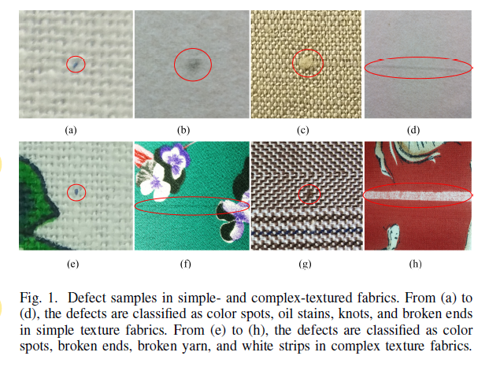
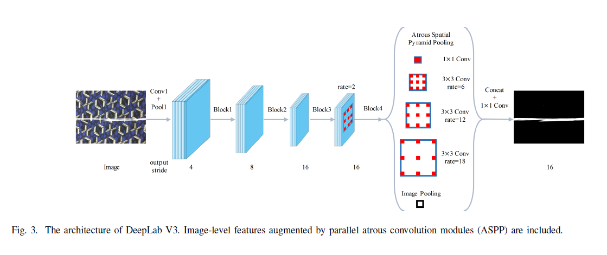

# Abstract

用多阶段的GAN来合成defects到新采集的、没有瑕疵的样本上

- First：一个 texture-conditioned GAN 被训练来生成特定背景的疵点块（这些疵点块最后会被贴到新收集的样本中，然后再丢到二阶段的GAN中去生成一张有疵点的平滑图）
- Second：GAN-based fusion network 融合一阶段生成的疵点块到新样本的特定位置
- Finally：二阶段生成的疵点样本添加到数据集中，训练一个新的semantic segmentation network

# Introduction

介绍一些检测的方法，但是这些方法难以解决复杂背景的布匹

- Fourier transform
- nonlocally centralized sparse representation（NCSR）
- Fisher criterion-based stacked denoising autoencoder（FCSDA）

现实世界中的织物检测方法所面临的困难：

- 大量地标注数据十分消耗时间，织物和织物瑕疵的多样性让收集一个全面的数据集变得十分困难
- 工序和材料的不同，不同瑕疵的外观和特征非常不同

本文

- 假设织物缺陷和背景信息遵循一个条件分布，给定一个织物背景，生成模型的目标是合成defects到织物背景上，因此当处理一种新的织物时，收集和标注数据是不必要的

# Related Works

Semantic Segmentation

- CNN采用连续池化和调整步长来增加感受野，从而在特征分辨率降低的同时学习更多abstract features
- FCN用于解决分辨率降低的问题，它用卷积代替了所有的全连接层，然后upsampling 被用在范围减少的特征上从而输出一个密集像素标注图
- SegNet 映射encoder生成的low-resolution的图片给pixelwise predictions，并且使用一个由一些upsampling和一个softmax层组成的decoder在最后。每一个upsamping区拥有一个upsampling layer和数个相继的卷积层，并且他们的最大池化对应encoder的pooling层
- 一些方法集成了全局信息到cnn
  - CRFs
  - atrous convolution
  - feature fusion

Generative Adversarial Networks

- pix2pix for image-to-image translation
- primal GAN aims to explore the mapping relationship from source images to target images
- dual GAN performs the inverse task to primal GAN
- image manipulation tasks:
  - SRGAN for super-resolution
  - ID-CGAN for image de-raining
  - IAN  for photo modification
  - Context Encoders  for image in-painting.

# METHODOLOGY

三种主要方法的细节

- segmentation network
- multi-stage GAN
- fine-tuning strategy

A. Framework Description

- 现存有的织物数据被用来训练segmentation network（DeepLab V3，修改了一些atrous convolutional layers 的atrous rate，并且加入了一个wegiht parameter）
- 基于现有的数据，合成更多不同织物的缺陷样本

B. Segmentation Network

- 为了在更深层保留feature maps 的大小，DeepLab 使用atrous convolution 而不是striding
- 使用ResNet-50作为backbone network，然后atrous convolution被用来替代连续的striding，并且atrous rates根据需要的输出步值而设置
- 部署一个 atrous spatial pyramid pooling (ASPP) 函数在feature map 的顶部。 函数包含了四个平行的、带有不同atrous rate的 atrous convolutions。为了提取global features, 一个方法是设置一个非常大的atrous rate，但是这样有可能造成filter被下降得更小，从而可能没有捕获到global information。因此，DeepLab给ASPP增加了一个全局信息分支，包含了average pooling， 1 * 1 conv， upsampling。

- 织物检测的三个问题：

  - output stride 不能设置得过大。本文设置为了8而不是16
  - 没有应用CRFs来对边缘进行提炼
  - modifacations to the loss function. add different weights to the defect segmentation to the defect segmentation and the background segmentation($\alpha_1 = 1, \alpha_2 = 9$)

  $$
  L = \alpha_1 L_{background} + \alpha_2L_{defect}
  $$

  

C. Synthesizing Novel Defective Samples Using a Multistage GAN

**stage1**

- ‘style label’代表新织物样本的背景信息。收集新织物补丁作为stage 1的输入，他们从不带有defect的区域随机裁剪下来
- 一个 pretrained 的 VGGNet被用来提取这些补丁的信息
- 

