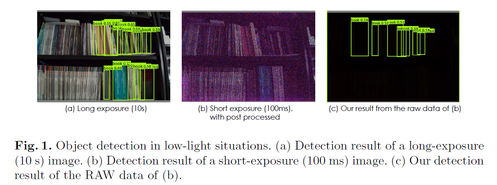
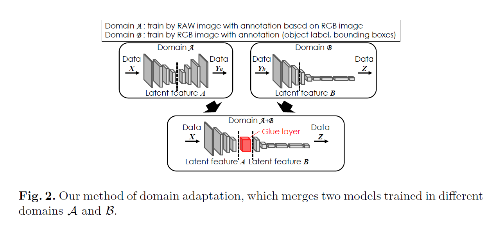
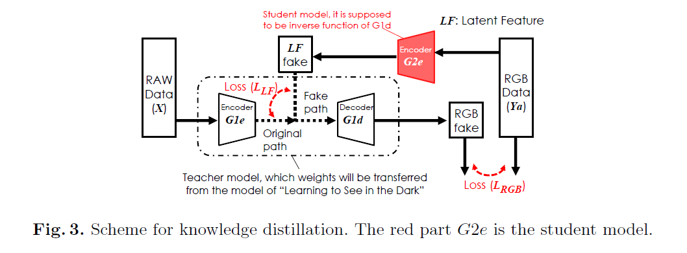
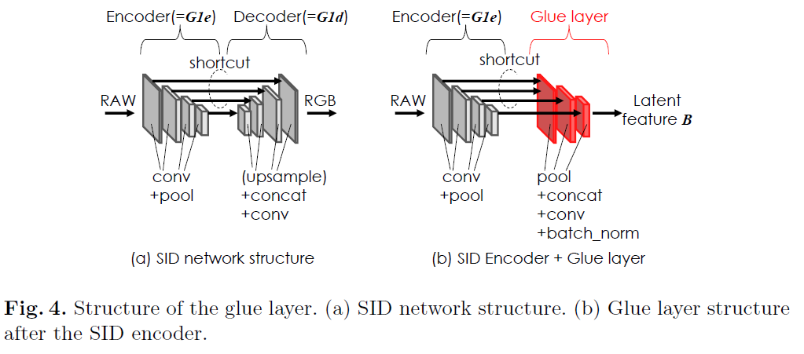
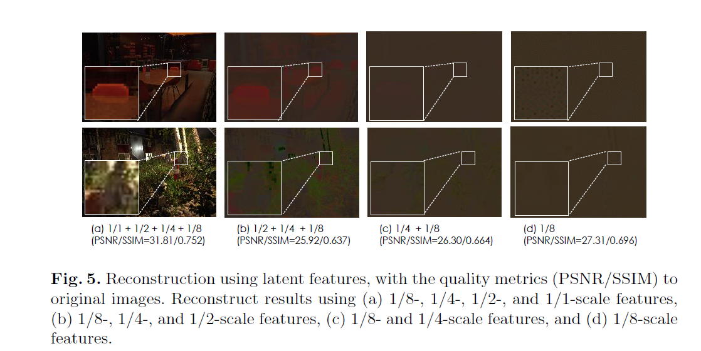
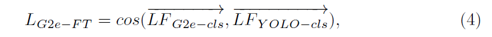

[TOC]

# Abstract

- 生成在黑夜中能够检测的model，需要额外的数据，这是很难得到的
- 新提出的模型不用额外的数据，这个方法用粘合层和一个生成模型合并了许多不同领域的预训练模型。
- 同时提出一个生成模型，模型从预训练模型提取知识。
- 提出的YOLO-in-the-Dark 模型由两个模型组成: Learning-to-See-in-the-Dark model 和 YOLO

# Introduction

​	低光亮图片的视觉任务比较困难，解决方案有增强光线，但此时会带来噪点，从而影响到任务的结果。

​	另一种解决方案是使用一个另外的dataset，但是这样的工程量很大。

​	本文的解决方法是采用知识蒸馏，复用其他的模型来完成相关的视觉任务。

- 图1是高曝光的检测结果
- 图2是短曝光然后又做了光线增强的结果
- 图3是本文方法的结果

## **Inverse mapping**

​	Inverse mapping是一个image-to-image的转换，他的目标是找到一个source(A)和target(B)之间的映射。AEGAN是一个使用基于生成对抗网络来获得一个逆生成器。

​	Invertible AutoEncode 是一个image-to-image的转换。转换器$F_{AB}(A\ \ to\ \ B) and F_{BA}(B\ \ to\ \ A)$ 把InvAuto作为encoder和decoder的一部分分享。

## **Hints for knowledge distillation**

​		这种方法选择teacher network的hidden layers作为hint layers，并且选择student network的guided layers来对应hidden layers。

# YOLO in the Dark

​	本文的方法合并了两个在不同领域训练的模型。他们通过一个glue layer联合到一起。

​	SID model在low-light images上表现十分良好，所以采用SID model作为model A， 而YOLO则作为模型B。

## **Generative model for domain adaptation**

​	本文定义一个生成模型，并使用知识蒸馏的方法来训练glue layer。

​	  生成模型即（G2e）从Ya输出latent feature（LF），Ya即figure 2中所生成。SID模型是一个encoder-decoder structure，所以generative model是decoder的逆。

​	  在训练中，在RGB data(Ya)和G2e-G1d 训练得到的RGB fake之间使用了loss
$$
L_{RGB} = ||RGB_{data} - RGB_{fake}||_1 \tag{1}
$$
​	并且在来自G2e的LF和G1e的LF之间使用
$$
L_{LF} = \sum_{i}||LF^{i}_{G2e} - LF^i_{G1e}||_1
$$
i指的是输出层的索引。最后再把上述两个loss加起来。

SID network是基于 U-net，由一个encoder和一个decoder组成。SID有四个等级的features，分别对应1/1, 1/2, 1/4, 1/8的pooling。

​	从上图可以看出，latent feature用得越多，生成的图片越相似，因此本文选择了所有的latent feature。

​	根据glue layer的结构，生成模型的知识被提取出来，fig6展示了重建的RGB images，与SID model生成的RGB非常相似。

​	在本文中，也通过调整G2e来改善每个模型碎片中的latent future。本文使用了classifier network的结果来最优化generative model。使用cosine similarity作为classifier network（G2e-cls）和YOLO（yolo-cls）之间的finetuning loss $L_{G2e}-FT$ 

## Training environment

