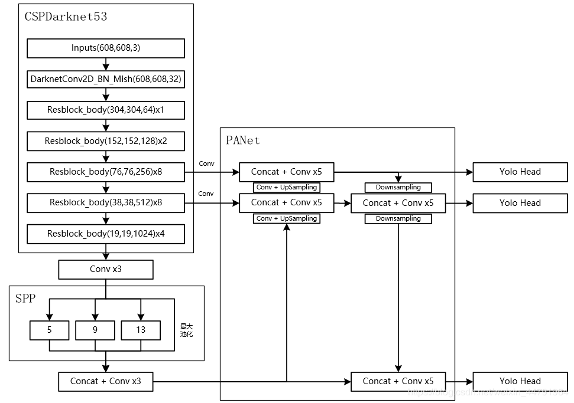
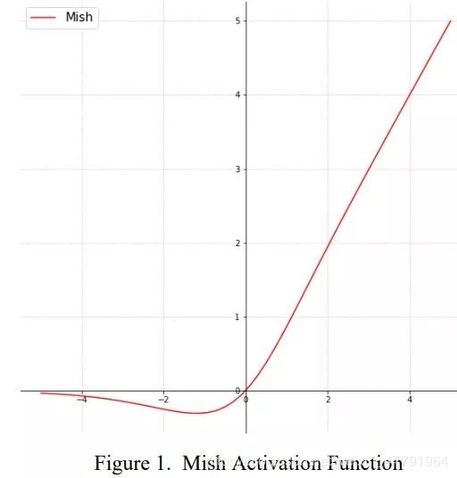
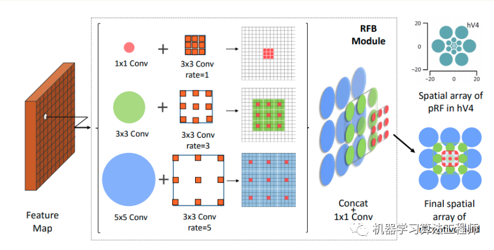
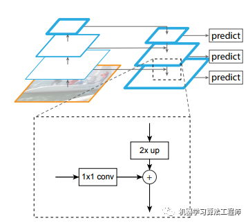
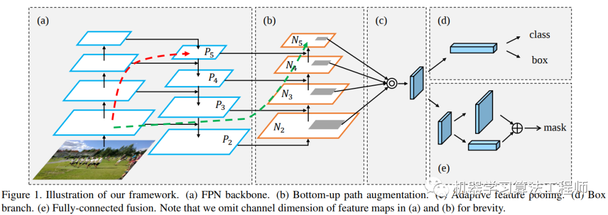
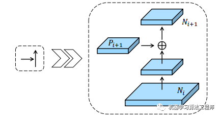
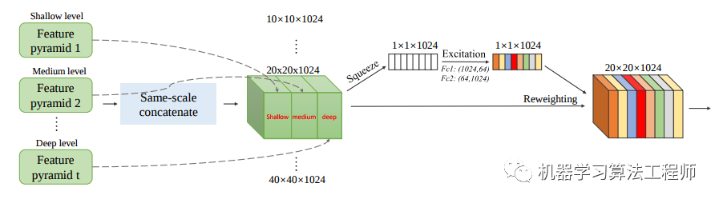
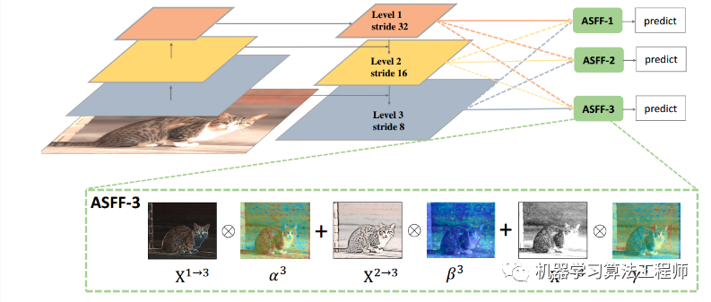
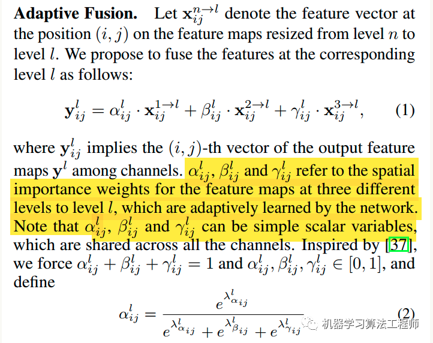
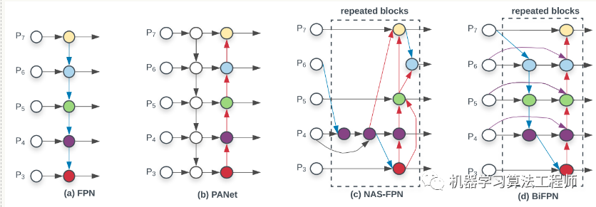

[TOC]

# Introduce

- [参考](https://www.cnblogs.com/pprp/p/12771430.html)


# Network

- [参考](https://blog.csdn.net/weixin_44791964/article/details/106533581)

## (416,416,3)


## (608，608，3）




## Mish

$$
Mish = x \times \tanh(\ln(1+e^x))
$$




# Innovation

## Mosaic


将四张不同的图片嵌入到一张图中，其优点是：

- 混合四张具有不同语义信息的图片，可以让检测器检测超出常规语境的目标，增强模型的鲁棒性。
- 由于BN是从四张图片计算得到的，所以可以减少对大的mini-batch的依赖


## self-Adversarial Training

自对抗训练也是一种新的数据增强方法，可以一定程度上抵抗对抗攻击。其包括两个阶段，每个阶段进行一次前向传播和一次反向传播。

- 第一阶段，CNN通过反向传播改变图片信息，而不是改变网络权值。通过这种方式，CNN可以进行对抗性攻击，改变原始图像，造成图像上没有目标的假象。
- 第二阶段，对修改后的图像进行正常的目标检测。


## CMBN


- BN是对当前mini-batch进行归一化。
- CBN是对当前以及当前往前数3个mini-batch的结果进行归一化。
- CmBN则逐渐累积

## SAM


## PAN


# The augmentation method used in paper

- [参考](https://mp.weixin.qq.com/s?__biz=MzUyMjE2MTE0Mw==&mid=2247489497&idx=2&sn=62a737bbec6c45dc46558b770d4c5306&chksm=f9d14941cea6c057330b805ace0f8b8d90b1878e562dfce681b77403ddfc739fc949c4c0abaf&scene=126&sessionid=1589551174&key=b053b5f9fd7f08e6870b241b0d81123decb0304ec6d626e61d33cc0ab67b09eb26a50da657495bca6d325ad00d33c41c6b5d9537fa75d902cea1d2d1058559d14a3bf853e21c0a5bbac99308e2a8e0d9&ascene=1&uin=MjUwOTM4MzI0MA%3D%3D&devicetype=Windows+10+x64&version=62090070&lang=zh_CN&exportkey=AeX%2BRyyFYZu3x6iaL9PvTq8%3D&pass_ticket=7%2BDndBTHQX4iS1onEy3XluyQaBW7CmGEgyO5danhG2Deo2FCa8PPQ7IhBoe40S4M)

## cutmix

- A method of mixing the cutout and mixup


​	**mixup相当于是全图融合，cutout仅仅对图片进行增强，不改变label，而cutmix则是采用了cutout的局部融合思想，并且采用了mixup的混合label策略，看起来比较make sense。**

​    **cutmix和mixup的区别是，其混合位置是采用hard 0-1掩码，而不是soft操作,相当于新合成的两张图是来自两张图片的hard结合，而不是Mixup的线性组合。但是其label还是和mixup一样是线性组合**。
$$
\hat{x} = M \odot x_{A} + (1 - M) \odot x_{B} \\
\hat{y} = \lambda y_{A} + (1 - \lambda)y_{B}
$$
M是和原图大小一样的矩阵，只有0-1值，$\lambda$ 用于控制线性混合度，通过$\lambda$ 参数可以控制裁剪矩形的大小
$$
r_x \backsim Unif(0,W), r_w = W \sqrt{1 - \lambda} \\

r_y \backsim Unif(0,H), r_h = H \sqrt{1 - \lambda}
$$


​	Mosaic增强是本文提出的，属于cutmix的扩展，**cutmix是两张图混合，而Mosaic增强是4张图混合**，好处非常明显是一张图相当于4张图，等价于batch增加了，可以显著减少训练需要的batch size大小。


## label smooth

- 核心就是对label进行soft操作，不要给0或者1的标签，而是有一个偏移，相当于在原label上增加噪声，让模型的预测值不要过度集中于概率较高的类别，把一些概率放在概率较低的类别。


## dropBlock

- [参考](https://www.pianshen.com/article/2769164511/)

​	dropBlock是在dropout上的推广。 dropout，训练阶段在每个mini-batch中，依概率P随机屏蔽掉一部分神经元，只训练保留下来的神经元对应的参数，屏蔽掉的神经元梯度为0，参数不参数与更新。而**测试阶段则又让所有神经元都参与计算**。

​	dropout操作流程：参数是丢弃率p
  1）在训练阶段，每个mini-batch中，按照伯努利概率分布(采样得到0或者1的向量，0表示丢弃)随机的丢弃一部分神经元（即神经元置零）。用一个mask向量与该层神经元对应元素相乘，mask向量维度与输入神经一致，元素为0或1。
  2）然后对**神经元rescale操作**，即每个神经元除以保留概率1-P,也即乘上1/(1-P)。
  3）反向传播只对保留下来的神经元对应参数进行更新。
  4）测试阶段，Dropout层不对神经元进行丢弃，保留所有神经元直接进行前向过程。

  为啥要rescale呢？是为了保证训练和测试分布尽量一致，或者输出能一致。可以试想，如果训练阶段随机丢弃，那么其实dropout输出的向量，有部分被屏蔽掉了，可以等下认为输出变了，如果dropout大量应用，那么其实可以等价为进行模拟遮挡的数据增强，如果增强过度，导致训练分布都改变了，那么测试时候肯定不好，**引入rescale可以有效的缓解，保证训练和测试时候，经过dropout后数据分布能量相似**。

```python
#!encoding=utf-8
import numpy as np
def dropout(x, drop_out_ratio,type="train"):
     # drop_out_ratio是概率值，必须在0~1之间
    if drop_out_ratio < 0. or drop_out_ratio>= 1: 
        raise Exception('Dropout level must be in interval [0, 1[.')
    if type=="train":
        scale = 1. / (1. - drop_out_ratio)
         # 即将生成一个0、1分布的向量，0表示这个神经元被屏蔽，不工作了，也就是dropout了
        mask_vec = np.random.binomial(n=1, p=1. - drop_out_ratio,size=x.shape) 
        print mask_vec
 
        x *= mask_vec                                                                            # 0、1与x相乘，我们就可以屏蔽某些神经元，让它们的值变为0
        x*=scale                                                                                     #再乘上scale系数
        print x
    return x
 
x=[100,29.5,1,2.0,3,4,23,12,34,45,667,76]
dratio=0.4
xnp=np.array(x)
 
print x
dropout(xnp,dratio,"train")
 
```

​	dropout方法多是作用在全连接层上，在卷积层应用dropout方法意义不大。文章认为是因为每个feature map的位置都有一个感受野范围，仅仅对单个像素位置进行dropout并不能降低feature map学习的特征范围，也就是说网络仍可以通过该位置的相邻位置元素去学习对应的语义信息，也就不会促使网络去学习更加鲁邦的特征。

 	 既然单独的对每个位置进行dropout并不能提高网络的泛化能力，那么很自然的，如果我们按照一块一块的去dropout，就自然可以促使网络去学习更加鲁邦的特征。思路很简单，就是**在feature map上去一块一块的找**，进行归零操作，类似于dropout，叫做dropblock。


 	绿色阴影区域是语义特征，b图是模拟dropout的做法，随机丢弃一些位置的特征，但是作者指出这做法没啥用，因为网络还是可以推断出来，(c)是dropBlock做法。


​	dropblock有三个比较重要的参数，一个是block_size，用来控制进行归零的block大小；一个是γ，用来控制每个卷积结果中，到底有多少个channel要进行dropblock；最后一个是keep_prob，作用和dropout里的参数一样。
$$
\gamma = \frac{1 - keep\_prob}{block\_size ^ 2} 
\frac{feat\_size^2}{(feat\_size - block\_size + 1)}
$$
​	 M大小和输出特征图大小一致，非0即1，为了保证训练和测试能量一致，需要和dropout一样，进行rescale。

 	 上述是理论分析，在做实验时候发现，block_size控制为7*7效果最好，对于所有的feature map都一样，γ通过一个公式来控制，**keep_prob则是一个线性衰减过程，从最初的1到设定的阈值(具体实现是dropout率从0增加到指定值为止)，论文通过实验表明这种方法效果最好。如果固定prob效果好像不好。**实践中，并没有显式的设置的值，而是根据keep_prob(具体实现是反的，是丢弃概率)来调整

  DropBlock in ResNet-50 DropBlock加在哪？**最佳的DropBlock配置是block_size=7，在group3和group4上都用**。将DropBlock用在skip connection比直接用在卷积层后要好，具体咋用，可以看代码。

```python

class DropBlock2D(nn.Module):
    r"""Randomly zeroes 2D spatial blocks of the input tensor.

    As described in the paper
    `DropBlock: A regularization method for convolutional networks`_ ,
    dropping whole blocks of feature map allows to remove semantic
    information as compared to regular dropout.

    Args:
        drop_prob (float): probability of an element to be dropped.
        block_size (int): size of the block to drop

    Shape:
        - Input: `(N, C, H, W)`
        - Output: `(N, C, H, W)`

    .. _DropBlock: A regularization method for convolutional networks:
       https://arxiv.org/abs/1810.12890

    """

    def __init__(self, drop_prob, block_size):
        super(DropBlock2D, self).__init__()

        self.drop_prob = drop_prob
        self.block_size = block_size

    def forward(self, x):
        # shape: (bsize, channels, height, width)

        assert x.dim() == 4, 
            "Expected input with 4 dimensions (bsize, channels, height, width)"

        if not self.training or self.drop_prob == 0.:
            return x
        else:
            # get gamma value
            gamma = self._compute_gamma(x)

            # sample mask
            mask = (torch.rand(x.shape[0], x.shape[2:]) < gamma).float()

            # place mask on input device
            mask = mask.to(x.device)

            # compute block mask
            block_mask = self._compute_block_mask(mask)

            # apply block mask
            out = x * block_mask[:, None, :, :]

            # scale output
            # 最后计算的时候只要把那些为1的加起来，就是没有被drop的区域
            out = out * block_mask.numel() / block_mask.sum()

            return out

    def _compute_block_mask(self, mask):
        # 比较巧妙的实现，用max pool来实现基于一点来得到全0区域
        block_mask = F.max_pool2d(input=mask[:, None, :, :],
                                  kernel_size=(self.block_size, self.block_size),
                                  stride=(1, 1),
                                  padding=self.block_size // 2)
		# 经max_pool之后，宽和高会多出一行，去掉
        if self.block_size % 2 == 0:
            block_mask = block_mask[:, :, :-1, :-1]

        block_mask = 1 - block_mask.squeeze(1)

        return block_mask

    def _compute_gamma(self, x):
        return self.drop_prob / (self.block_size ** 2)
```


# BN Improvement


假设输入维度是(N,C,H,W),不管哪一层归一化手段，都不会改变输出大小，即输出维度也是(N,C,H,W)。

## BN


  BN本质意思就是在Batch和HxW维度进行归一化，可以看出和batch相关，如果batch比较小，那么可能统计就不准确。并且**由于测试时候batch可能和训练不同，导致分布不一致，故还多了两个参数：全局统计的均值和方差值**，从而**eval模式**是必须开的.

```python
m = nn.BatchNorm2d(100)
m = nn.BatchNorm2d(100,affine = False)
input = torch.randn(20,100,35,45)
output = m(input)
```


## LN

​	对于LN，**其归一化维度是C、HxW维度或者HxW维度或者W维度，但是不可以归一化维度为H**，可以设置，比较灵活，其对每个batch单独进行各自的归一化操作，归一化操作时候不考虑batch，所以可以保证训练和测试一样。 

```python
m = nn.LayerNorm(normalized_shape=[100 ,35 ,45])
input = torch.randn(20, 100, 35, 45)
```

​	其可学习权重维度是(100,35,45)：**对batch输入计算均值和方差(C、H和W维度求均值)，输出维度为(N,)，然后对输入(N,C,H,W)采用计算出来的(N,)个值进行广播归一化操作，最后再乘上可学习的(C,H,W)个权重参数即可**。当然也可以设置为(35,45)，意思同样理解。

​	可以看出其归一化是在指定输入shape情况下的归一化，和batch无关。故可以保证训练和测试一致，**不需要强制开启eval模式**。

**通过设置输入参数shape为(H,W),其实就是IN归一化了，比较灵活。**


## IN


```python
m = nn.InstanceNorm2d(100)
m = nn.InstanceNorm2d(100, affine = True)
input = torch.randn(20,100,35,45)
output = m(input)
```

 	输入参数必须且只能是C，其内部计算是：**对batch输入计算均值和方差(H,W维度求均值方差)，输出维度为(N,C),然后对输入(N,C,H,W)采用计算出来的(N,C)个值进行广播归一化操作，最后再乘上可学习的(C,)个权重参数即可**。

​	由于其计算均值和方差和batch没有关系，故也不需要强制开启eval模式。


## GN

 	GN是介于LN和IN之间的操作，多了一个group操作

```python
input = torch.randn(20, 6, 10, 10)
m = nn.GroupNorm(3,6)
output = m(input)
```

​	 注意第一个参数分组数必须能够将输入通道整除，否则会报错，因为无法均匀分组。其内部计算是：**对batch输入计算均值和方差(C/组数、H,W维度求均值方差)，输出维度为(N,组数),然后对输入(N,C,H,W)采用计算出来的(N,组数)个值进行广播归一化操作，最后再乘上可学习的(C,)个权重参数即可**。不需要强制开启eval模式。


## FRN

​	虽然GN解决了小batch size时的问题，但在正常的batch size时，其精度依然比不上BN层。有什么办法能解决归一化既不依赖于batch，又能使精度高于BN呢？FRN就是为了解决这个问题。


​	  要解决batch依赖问题，则不能对batch维度进行归一化。FRN层由两部分组成，Filtere Response Normalization (FRN)和Thresholded Linear Unit (TLU)。


**(1) FRN**

  N是HxW,表面看起来计算方式非常类似IN，计算过程是：**对输入的batch个样本在HxW维度上计算方差，不计算均值，得到输出维度(batch,c)，然后对(batch,c,h,w)进行除方差操作，并且引入可学习参数，权重维度是(C,),最后对上述输出乘以可学习参数即可输出。**

其中，ϵ是一个很小的正常数，防止除以零。

***(2) TLU***

  由于在FRN操作中**没有减去均值**，会导致“归一化”后的特征值不是关于零对称，可能会以任意的方式偏移零值。如果使用ReLU作为激活函数的话，会引起误差，产生很多零值，性能下降。所以需要对ReLU进行增强，即TLU，引入一个可学习的阈值τ 
$$
Z_{TLU} = max(y, \tau) = max(y - \tau, 0) + \tau = ReLU(y - \tau) + \tau
$$


从上面来看，**FRN层引入了γ、β和τ三个可学习的参数，分别学习变换重构的尺度、偏移和阈值，他们都具有C个值，对应每一个通道。**
$$
\hat{x} = \frac{x}{\sqrt{v^2 + \varepsilon}}
$$


​	  一般情况下，特征图的大小N=H×W都比较大，但也有N=1的情况（全连接或者特征图为1×1）。在N=1的情况下，若ϵ很小，上式则会变成一个sign函数，梯度值变得很小，不利于优化；若ϵ相对较大，则曲线会平滑一点，容易优化。


​	故在实现方面，在N=1的情况下，将ϵ变成一个可学习的参数（初始化为10−4）；而对于N≠1时，将其固定为10−6。为了保证可学习参数ϵ>0，对其进行一定限制($\varepsilon_l$ being a learned parameter)
$$
\varepsilon = 10^{-6} + + |\varepsilon_l|
$$


```python
def FRNLayer(x, tau, beta, gamma, eps = 1e-6):
    # x: Input tensor of shape [BxHxWxC].
	# tau, beta, gamma: Variables of shape [1, 1, 1, C].
	# eps: A scalar constant or learnable variable.
    
	# Compute the mean norm of activations per channel.
    nu2 = tf.reduce_mean(t.square(x), axis = [1,2], keepdims = True)
    
    # Perform FRN.
    x = x * tf.rsqrt(nu2 + tf.abs(eps))
    
    # Return after applying the Offset-ReLU non-linearity.
    return tf.maximum(gamma * x + beta, tau)
```

 另外在实验上，存在几个细节：

1. 由于FRN层没有均值中心化，所以会有一些模型对初始学习率的选择十分敏感，特别是那些使用了多个最大池化层的网络。为了缓解这个问题，**作者建议使用warm-up来对学习率进行调整。** 
2.  一般而言，FC层后一般都不会接归一化层，这是因为均值和方差计算的数量太少，难以正确估计。但**如果FC层后接FRN层，性能不会下降，反而会有上升。** 
3. 作者对BN+TLU或者GN+TLU或者FRN+ReLU等都做过实验对比，还是发现**FRN+TLU的搭配是最好**。


## CMBN


CMBN把大batch内部的4个mini batch当做一个整体，对外隔离，主要改变在于BN层的统计量计算方面，具体流程是：假设当前是第t次迭代时刻，也是mini-batch的起点， 

1. 在第t时刻开始进行梯度**累加操作** 
2. 在第t时刻开始进行BN统计量汇合操作，这个就是和CBN的区别，CBN在第t时刻，也会考虑前3个时刻的统计量进行汇合，而CmBN操作不会，其仅仅在mini batch内部进行汇合操作 
3. 就是正常的应用BN，对输入进行变换输出即可 
4. 在mini batch的最后一个时刻，进行参数更新和可学习参数更新


  可以明显发现CmBN是CBN的简化版本，其唯一差别就是在计算第t时刻的BN统计量时候，CBN会考虑前一个mini batch内部的统计量，而CmBN版本，所有计算都是在mini batch内部。我怀疑是为了减少内存消耗，提高训练速度，既然大家都是近似，差距应该不大，而且本身yolo训练时候，batch也不会特别小，不至于是1-2，**所以CmBN的做法应该是为了yolov4专门设计的，属于实践性改进。**


# network approvement

## add receptive field

- 论文中主要是提到了三种结构：SPP层、ASPP和RFB。 

### spp


内部采用不同大小的kernel size和strdie实现不同感受野特征输出，然后concat即可，在yolov3-spp里面有具体结构：

 ```python
 ---- START SPP -----
[maxpool]
stride=1
size=5

[route]
layers=-2

[maxpool]
stride=1
size=9

[route]
layers=-4

[maxpool]
stride=1
size=13

[route]
layers=-1,-3,-5,-6

----End SPP ----
 ```

  即上一层的特征图输入是13x13x512，然后三个分支分别是stride=1，kernel size为5,9,13,然后三个图拼接，得到13x13x2048的图，然后

 ```python

[convolutional]
batch_normalize=1
filters=512
size=1
stride=1
pad=1
activation=leaky
 ```

  接一个1x1卷积，得到13x13x512的特征图，然后进行后续操作。


### aspp


​	 ASPP和SPP的差别是，并不是采用max pool得到不同感受野的特征图，而是采用卷积实现，且其kernel size全部是3，但是引入了不同的空洞率来变相扩大感受野。其余操作和SPP一致，ASPP来自DeepLab论文。


### rfb



 	 RFB结构来自RFBNet，效果不错，计算量也不大，可以看出RFB是ASPP的推广，其采用了不同大小的kernel和不同的空洞率，**相比ASPP，计算量减少不少，效果应该差不多**。RFB在推理阶段引入的计算量非常xi小，但是在ssd中AP提高蛮多，是个不错的选择。


## feature fusion

-   特征融合，主要是指不同输出层直接的特征融合，主要包括FPN、PAN、SFAM、ASFF和BiFPN。

### FPN

  FPN是目前最主流的不同层融合方案，应用非常广泛，其结构为：



 	 FPN仅仅融合相邻层的特征图，采用上采样或者下采样操作得到尺度一致的特征图，然后采用add操作得到融合后特征图。

### pan



​	FPN加入top-down的旁路连接，能给feature增加high-level语义,有利于分类。但是PAN论文作者觉得low-level的feature很有利于定位，虽然FPN中P5也间接融合了low-level的特征，但是信息流动路线太长了如红色虚线所示，其中会经过超多conv操作，本文在FPN的P2-P5又加了low-level的特征，最底层的特征流动到N2-N5只需要经过很少的层如绿色需要所示，主要目的是加速信息融合,缩短底层特征和高层特征之间的信息路径。down-top的融合做法是： 



### sfam



​	SFAM全称是Scale-wise Feature Aggregation Module，不同尺度的特征进行重组和融合，基本原理是对不同TUM的输出（每个TUM有6个不同尺度的输出），将其中相同尺度的特征进行concat，然后经过一个SE模块（对通道进行reweighting）输出，然后进行检测。其实就是把相同尺度的各层金字塔特征提取出来，然后concat，经过se模块，进行通道加权，再进行后续的预测，实现对不同通道进行不同加权功能。看起来开销有点大呀，因为要多个stage。

  	和FPN及其改进版本的不同是SFAM的融合是尺度感知的，只融合相同尺度的特征，而不是像FPN那样，强制上下采样然后进行融合。


### asff



​	FPN操作是一个非常常用的用于对付大小尺寸物体检测的办法，作者指出FPN的缺点是不同尺度之间存在语义gap，举例来说基于iou准则，某个gt bbox只会分配到某一个特定层，而其余层级对应区域会认为是背景(**但是其余层学习出来的语义特征其实也是连续相似的，并不是完全不能用的**)，如果图像中包含大小对象，则不同级别的特征之间的冲突往往会占据要素金字塔的主要部分，这种不一致会干扰训练期间的梯度计算，并降低特征金字塔的有效性。一句话就是：**目前这种concat或者add的融合方式不够科学。本文觉得应该自适应融合，自动找出最合适的融合特征** 。
​	  简要思想就是：原来的FPN add方式现在变成了add基础上多了一个可学习系数，该参数是自动学习的，可以实现自适应融合效果，类似于全连接参数。 
 	 ASFF具体操作包括 identically rescaling和adaptively fusing。 
​	  定义FPN层级为l，为了进行融合，对于不同层级的特征都要进行上采样或者下采样操作，用于得到同等空间大小的特征图，上采样操作是1x1卷积进行通道压缩，然后双线性插值得到；下采样操作是对于1/2特征图是采样3 × 3 convolution layer with a stride of 2，对于1/4特征图是add a 2-stride max pooling layer然后引用stride 卷积。其自适应融合过程如下： 



具体操作为： 

1.  首先对于第l级特征图输出cxhxw，对其余特征图进行上下采样操作，得到同样大小和channel的特征图，方便后续融合 
2. 对处理后的3个层级特征图输出，输入到1x1xn的卷积中(n是预先设定的)，得到3个空间权重向量，每个大小是nxhxw 
3. 然后通道方向拼接得到3nxhxw的权重融合图 
4. 为了得到通道为3的权重图，对上述特征图采用1x1x3的卷积，得到3xhxw的权重向量 
5. 在通道方向softmax操作，进行归一化，将3个向量乘加到3个特征图上面，得到融合后的cxhxw特征图 
6. 采用3x3卷积得到输出通道为256的预测输出层


### bifpn



​	多尺度融合不仅仅是从下到上，也要从上到下，并且融合的参数都是学习出来的，不是简单的add或者concat就Ok的。