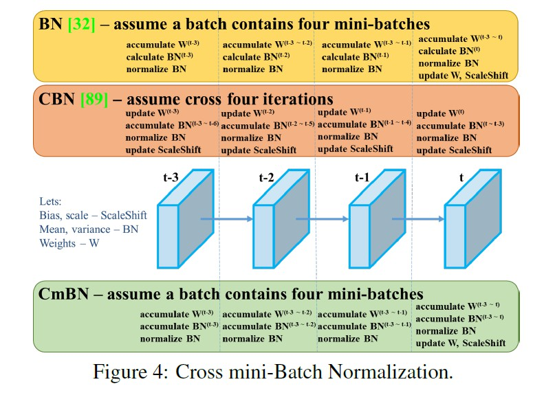

[TOC]

# Introduce

- [参考](https://www.cnblogs.com/pprp/p/12771430.html)

# 创新

## Mosaic

将四张不同的图片嵌入到一张图中，其优点是：

- 混合四张具有不同语义信息的图片，可以让检测器检测超出常规语境的目标，增强模型的鲁棒性。
- 由于BN是从四张图片计算得到的，所以可以减少对大的mini-batch的依赖

## self-Adversarial Training

自对抗训练也是一种新的数据增强方法，可以一定程度上抵抗对抗攻击。其包括两个阶段，每个阶段进行一次前向传播和一次反向传播。

- 第一阶段，CNN通过反向传播改变图片信息，而不是改变网络权值。通过这种方式，CNN可以进行对抗性攻击，改变原始图像，造成图像上没有目标的假象。
- 第二阶段，对修改后的图像进行正常的目标检测。

## CMBN

- BN是对当前mini-batch进行归一化。
- CBN是对当前以及当前往前数3个mini-batch的结果进行归一化。
- CmBN则逐渐累积

## SAM

### PAN

