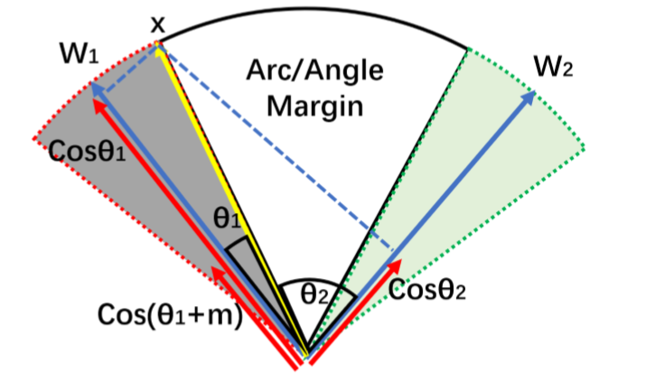

[TOC]

# ArcFace Loss

## Introduce

- [参考1](https://zhuanlan.zhihu.com/p/76541084) [参考2](https://blog.csdn.net/Wuzebiao2016/article/details/81839452) [参考3](https://blog.csdn.net/duan19920101/article/details/104445423) [类间距、类内距](https://www.cnblogs.com/liuwu265/p/4724758.html) [特征选择](https://blog.csdn.net/ycheng_sjtu/article/details/25343043)
- Additive Angular Margin loss(加性角度间隔损失函数)，对特征向量和权重归一化，对$\theta$ 加上角度间隔m，角度间隔比余弦间隔在对角度的影响更加直接。几何上有恒定的线性角度margen。
- ArcFace 中是直接在角度空间 $\theta$ 中最大化分类界限，而CosFace是在余弦空间 $\cos (\theta)$ 中最大化分类界限

## Softmax Loss

- 无论是SphereFace、CosineFace还是ArcFace的损失函数，都是基于传统的softmax loss进行修改得到的，所以想要理解ArcFace，需要对之前的损失函数有一定理解。

$$
L_S = - \frac{1}{m} \sum^{m}_{i=1}  \log{  (\frac{e^{W_{y_i}^T x_i + b_{y_i} }  } { \sum^{n}_{j=1}  e^{ W^{T}_{j} x_i + b_j} }) }
$$

- 这是传统的Softmax，$W_j^T x_i + b_j$ 代表全连接层的输出，在损失$L_S$下降的过程中，则必须提高$W^T_{y_i}x_i+b_{y_i}$ 所占有的比重，从而使得该类别的样本更多地落入岛该类的决策边界之内。

- **这种方式主要考虑样本是否能正确分类，缺乏类内和类间距离的约束。**

- 在[A Discriminative Feature Learning Approach for Deep Face Recognition]这篇文章中，作者使用了一个比LeNet更深的网络结构，用Mnist做了一个小实验来证明Softmax学习到的特征与理想状态下的差距。

- 实验结果表明，传统的Softmax仍存在着很大的类内距离，也就是说，通过对损失函数增加类内距离的约束，能达到比更新现有网络结构更加事半功倍的效果。于是，[A Discriminative Feature Learning Approach for Deep Face Recognition]的作者提出了**Center Loss**，并从不同角度对结果的提升做了论证。

  

  

## Center Loss

$$
L_C = \frac{1}{2} \sum^{m}_{i=1} \lVert x_i - c_{y_i} \rVert \\

\Delta c_j =\frac{\sum^m_{i=1} \delta(y_i =j) \cdot (c_j - x_i)}{1 + \sum^m_{i=1} \delta(y_i=j)}
$$

- Center Loss的整体思想是希望一个batch中的每个样本的feature离feature 的中心的距离的平方和要越小越好，也就是类内距离要越小越好。作者提出，最终的损失函数包含softmax loss和center loss，用参数λ来控制二者的比重，如下面公式所示：
  $$
  L = L_S + L_C=  - \frac{1}{m} \sum^{m}_{i=1}  \log{  (\frac{e^{W_{y_i}^T x_i + b_{y_i} }  } { \sum^{n}_{j=1}  e^{ W^{T}_{j} x_i + b_j} }) } \ \ + \ \ \frac{\lambda}{2} \sum^{m}_{i=1} {\lVert x_i - c_{yi} \rVert}^2
  $$
  
- 因而，加入了Softmax Loss对正确类别分类的考虑以及Center Loss对类内距离紧凑的考虑，总的损失函数在分类结果上有很好的表现力。以下是作者继上个实验后使用新的损失函数并调节不同的参数$\lambda$ 得到的实验结果，可以看到，加入了Center Loss后增加了对类内距离的约束，使得同个类直接的样本的类内特征距离变得紧凑。

## A-Softmax Loss(SphereFace)

- Center Loss的出现，使得人脸识别的研究转向损失函数的改进，对于之前的损失函数，研究发现Softmax Loss学习到的特征分辨性不够强，Center Loss **使得类内距离缩小，类间距离扩大，有效的将各个类别区分开**。而Contrastive Loss、Triplet Loss增加了时间上的消耗，[SphereFace: Deep Hypersphere Embedding for Face Recognition]这篇文章的作者提出了A-Softmax Loss。

- 在Softmax Loss 中，由 $W^T x = \lVert W\rVert \cdot \lVert x \rVert \cdot \cos \theta$, 特征向量相乘包含由角度信息，即Softmax使得学习到的特征具有角度上的分布特性，未来让特征学习到更可分的角度特性，作者对softmax Loss进行了一些改进
  $$
  L_{Softmax} = -\frac{1}{m} \sum^{m}_{i=1} 
  \log(
    \frac
    {
      e^ {
  	 \lVert W_{y_i}\rVert \cdot \lVert x_i \rVert \cdot \cos{\theta_{y_i}}+b_{y_i}
  	} 
    }{
       \sum^{n}_{j=1} 
       e^ {
  	   \lVert W_{j}\rVert \cdot \lVert x_i \rVert \cdot \cos{\theta_{j}}+b_{j}
  	 } 
    }
  ) 
  \\
  L_{modified_0} = -\frac{1}{m} \sum^{m}_{i=1} 
  \log(
  	   \frac{
  	   		e^{\lVert x_i \rVert \cdot \cos \theta_{y_i}}
  	   }{
  	   		e^{\lVert x_i \rVert \cdot \cos \theta_{y_i}} + 
  	   		\sum^{n}_{j=1,j=y_i} e^{\lVert x_i \rVert \cdot \cos \theta_j} 
  	   }
  )
  $$
  

  其中，作者在$L_{modified_0} 中约束了中约束了中约束了||W||=1$ 并且令 $b_j = 0$ ,并将$e^{ \lVert x_i \rVert \cdot \cos \theta_{y_i}} $ 从$\sum^{n}_{j=1} e^{\lVert x_j \rVert \cdot \cos \theta_j}$区分出来，就是为了让特征学习到更可分的角度特性。通过这样的损失函数学习，可以使得学习 到的特征具有更明显的角分布，因为决策边界只与角相关。

- 对于Softmax而言，希望能有 $\cos(\theta_1) > \cos(\theta_2)$，所以作者增加了在角度空间中对损失函数的约束 $cos(t \cdot \theta_1) > \cos(\theta_2)$ ，也就是要把同类数据压缩在一个紧致的空间，同时拉大类间差距
  $$
  L_{modified_1} = -\frac{1}{m} \sum^{m}_{i=1} 
  \log(
  	   \frac{
  	   		e^{\lVert x_i \rVert \cdot \cos (t \cdot \theta_{y_i})}
  	   }{
  	   		e^{\lVert x_i \rVert \cdot \cos \theta_{y_i}} + 
  	   		\sum^{n}_{j=1,j=y_i} e^{\lVert x_i \rVert \cdot \cos \theta_j} 
  	   } 
  ), \theta \in[0, \frac{\pi}{t}]
  $$
  

- 由于$\cos\theta在[0, \pi]$上单调递减，因此$\theta$有上界，为了使得这个函数随角度单调递减，作者构造一个函数去代替$\cos \theta$
  $$
  L_{SphereFace} = -\frac{1}{m} \sum^{m}_{i=1}
  \log(
  		\frac{
  			e^{ \lVert x_i \rVert \cdot \phi(\theta_{y_i})}
  		}{
  			e^{ \lVert x_i \rVert \cdot \phi(\theta_{y_i})} + 
  			\sum^{n}_{j=1,j=y_i}e^{\lVert x_i \rVert \cdot \cos \theta_j}
  		}
  ),\theta_{y_i} \in [0, \frac{\pi}{t}]
  
  \\
  
  \phi(\theta_{y_i}) = (-1)^k \cos(t\cdot \theta_{y_i})-2k, 
  \theta_{y_i} \in [\frac{k\pi}{t},\frac{(1+k)\pi}{t}], k\in[0,t-1]
  $$
  
- 在SphereFace的实际训练过程中，作者发现引入Softmax约束可以保证模型的收敛性。因此，对$\phi(\theta_{y_i})$函数做了变更，并同时用参数 $\lambda$ 来控制二者的比重

$$
\phi(\theta_{yi}) = \frac{(-1)^k \cos{(t \cdot \theta_{yi}) - 2k + \lambda \cdot \cos(\theta_{yi})}}{1 + \lambda}
$$

- t的大小是控制同一类点聚集的程度，从而控制了不同类之间的距离。如图可以看出不同的t的取值对映射分布的影响（不同的类位于一个单位超球表面的不同区域）

- 后续的F-Norm SphereFace对SphereFace做了更新，仅注重从数据中得到的角度信息，而不考虑特征向量的值，所以采用了s = 64 作为特征归一化参数替代了作为特征归一化参数替代了作为特征归一化参数替代了$||x||$，因此公式更新为：
  $$
  L_{F-Norm-SphereFace}= -\frac{1}{m} \sum^{m}_{i=1} 
  \log (\frac{
  	 e^{s \cdot \phi(\theta_{y_i}})
  }{
  	e^{s \cdot \phi(\theta_{yi})} + \sum^{n}_{j=1,y=yi} e^{s \cdot \cos{\theta_j}}
  }) ,\theta_{yi} \in [0, \frac{\pi}{t}]
  $$

## Cosine Margin Loss

$$
L_{Cosine} = - \frac{1}{m} \sum ^{m}_{i=1} \log(
\frac{
	e^{s \cdot (\cos(\theta_{yi})-t)}	
}{
	e^{s \cdot (\cos(\theta_{yi})-t)} + \sum ^{n}_{j=1, j = yi} e^{s \cdot \cos{\theta_{j}}}
})
$$

- 与SphereFace相比，CosineFace最明显的变化就是将$\cos(t \cdot \theta_{yi})$ 中的t提出来变成 $\cos(\theta_{yi})-t$,与之前相比，，这有几个优势
  - 相对于SphereFace而言要更加容易实现，移除$\phi(\theta_{yi})$ ,减少了复杂的参数计算
  - 去除了Softmax监督约束，训练过程变得简洁同时也能够实现收敛
  - 模型性能有明显的改善

## Angular Margin Loss

- 尽管在余弦范围到角度范围的映射具有一对一的关系，但他们之间仍有不同之处，事实上，实现角度空间内最大化分类界限相对于余弦空间而言具有更加清晰的几何解释性，角空间中的边缘差距也相当于超球面上的弧距。

- 于是，作者提出了Angular Margin Loss，将角度边缘t置于$\cos(\theta)$函数内部，使得$\cos(\theta + t)$范围内要小于

  $\cos(\theta)$，这一约束使得整个分类任务的要求变得更加苛刻。

- 对于$L_{Arcface} ，在满足，在满足，在满足W_j=\frac{W_j}{||W_j||},x_i=\frac{x_i}{||x_i||},cos{\theta_i}=W_j^Tx_i$的情况下，其损失计算公式为
  

$$
L_{Arcface} = - \frac{1}{m} \sum ^{m}_{i=1} \log(
\frac{
	e^{s \cdot (\cos(\theta_{yi} +t))}	
}{
	e^{s \cdot (\cos(\theta_{yi} + t))} + \sum ^{n}_{j=1, j = yi} e^{s \cdot \cos{\theta_{j}}}
})
$$

- 对于$\cos(\theta + t)$ 可以得到 $\cos(\theta + t) = \cos \theta \cos t - \sin \theta \sin t$ ， 对比CosineFace $\cos(\theta) -t$，ArcFace中的$\cos(\theta + t)$不仅形式简单，并且还动态依赖于$\sin \theta$，使得网络能够学习到更多的角度特性。