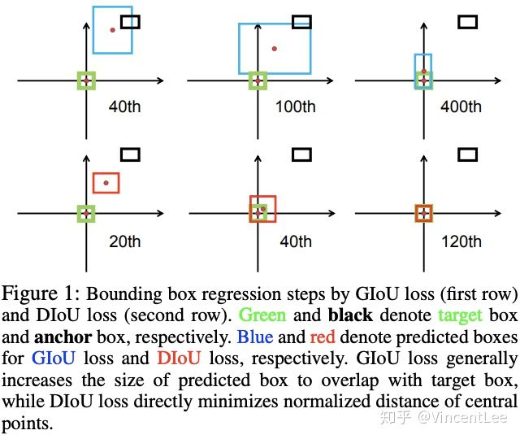
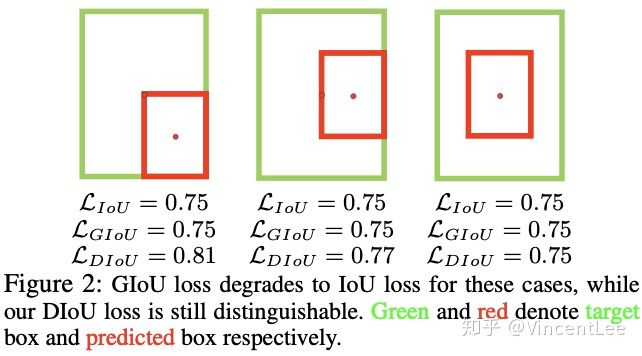
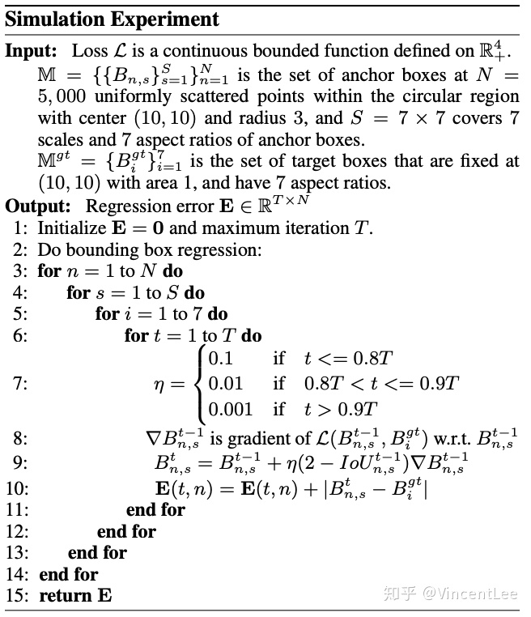
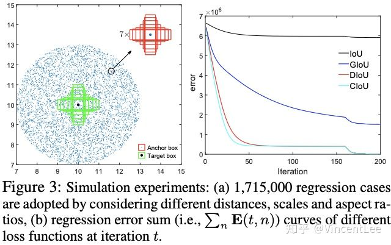
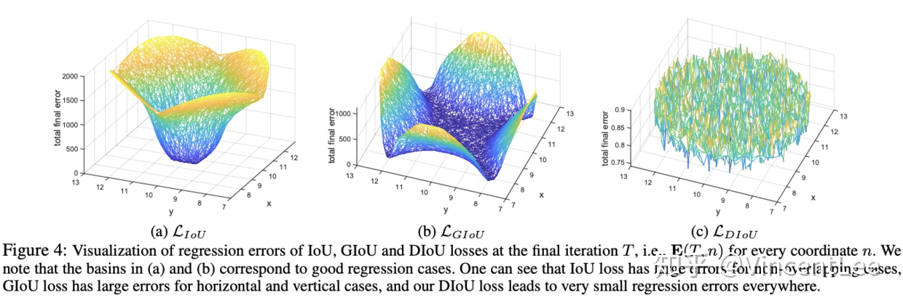
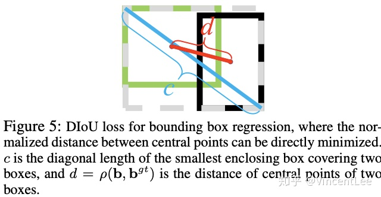

[TOC]

[参考](https://zhuanlan.zhihu.com/p/102956248)

# iou

- [参考](https://blog.csdn.net/qq_17550379/article/details/78815637)
- IoU是目标检测里面很重要的一个指标，通过预测的框和GT间的交集与并集的比例进行计算，经常用于评价bbox的优劣 。

$$
IoU = \frac{B \cap B^{gt} }{B \cup B^{gt}}
$$

```python
——————————
|        |
|	 ————|————
_____|___|    |  
     |        |
     _________
        
'''
    0,0 ------> x (width)
     |
     |  (Left,Top)
     |      *_________
     |      |         |
            |         |
     y      |_________|
  (height)            *
                (Right,Bottom)
'''
框的左上角为（xmin,ymin）右下角为（xmax,ymax）
坐标从上往下，从左往右递增
```


- 计算输入值
  - x:表示box中心x坐标
  - y:表示box中心y坐标
  - w：表示box的宽度
  - h：表示box的高度
- 在一张img中，左上角的坐标是(0，0),往右跟往下坐标递增
- demo1

```python
 '''
  这里boxes1,2最后一个纬度存放的是 [x, y , sqrt(w), sqrt(h)]
 '''
    def calc_iou(boxes1, boxes2):
        #提取w,h。因为yolov2中是用Sqrt(w) 和 sqrt(h)计算的，所以乘了平方
        boxx = tf.square(boxes1[:, :, :, :, 2:4])
        
        # w*h
        boxes1_square = boxx[:, :, :, :, 0] * boxx[:, :, :, :, 1]
        
        # x - w*0.5 这是box1的左边的中心
        # y - w*0.5 上边中心
        # x + w*0.5 右边中心
        # y + w*0.5 下边中心
        box = tf.stack([boxes1[:, :, :, :, 0] - boxx[:, :, :, :, 0] * 0.5,
                        boxes1[:, :, :, :, 1] - boxx[:, :, :, :, 1] * 0.5,
                        boxes1[:, :, :, :, 0] + boxx[:, :, :, :, 0] * 0.5,
                        boxes1[:, :, :, :, 1] + boxx[:, :, :, :, 1] * 0.5])
        boxes1 = tf.transpose(box, (1, 2, 3, 4, 0))

        boxx = tf.square(boxes2[:, :, :, :, 2:4])
        boxes2_square = boxx[:, :, :, :, 0] * boxx[:, :, :, :, 1]
        box = tf.stack([boxes2[:, :, :, :, 0] - boxx[:, :, :, :, 0] * 0.5,
                        boxes2[:, :, :, :, 1] - boxx[:, :, :, :, 1] * 0.5,
                        boxes2[:, :, :, :, 0] + boxx[:, :, :, :, 0] * 0.5,
                        boxes2[:, :, :, :, 1] + boxx[:, :, :, :, 1] * 0.5])
        boxes2 = tf.transpose(box, (1, 2, 3, 4, 0))
		
        # 相交面积左边中心，上边中心
        left_up = tf.maximum(boxes1[:, :, :, :, :2], boxes2[:, :, :, :, :2])
        
        # 相交面积右边中心，下边中心
        right_down = tf.minimum(boxes1[:, :, :, :, 2:], boxes2[:, :, :, :, 2:])
		
        # 右-左，下-上
        intersection = tf.maximum(right_down - left_up, 0.0)
        
        # w*h即面积
        inter_square = intersection[:, :, :, :, 0] * intersection[:, :, :, :, 1]
        	
        # 并    
        union_square = boxes1_square + boxes2_square - inter_square

        return tf.clip_by_value(1.0 * inter_square / union_square, 0.0, 1.0)

```

- demo2

  ```python
  float overlap(float x1, float w1, float x2, float w2)
  {
      float l1 = x1 - w1/2;
      float l2 = x2 - w2/2;
      float left = l1 > l2 ? l1 : l2;
      float r1 = x1 + w1/2;
      float r2 = x2 + w2/2;
      float right = r1 < r2 ? r1 : r2;
      return right - left;
  }
  
  float box_intersection(box a, box b)
  {
      float w = overlap(a.x, a.w, b.x, b.w);
      float h = overlap(a.y, a.h, b.y, b.h);
      if(w < 0 || h < 0) return 0;
      float area = w*h;
      return area;
  }
  
  float box_union(box a, box b)
  {
      float i = box_intersection(a, b);
      float u = a.w*a.h + b.w*b.h - i;
      return u;
  }
  float box_iou(box a, box b)
  {
      return box_intersection(a, b)/box_union(a, b);
  }
  
  ```


- demo3

  ```python
  # x y w h
  def jaccard(_box_a, _box_b):
      b1_x1, b1_x2 = _box_a[:, 0] - _box_a[:, 2] / 2, _box_a[:, 0] + _box_a[:, 2]/2
      b1_y1, b1_y2 = _box_a[:, 1] - _box_a[:, 3] / 2, _box_a[:, 1] + _box_a[:, 3]/2
      b2_x1, b2_x2 = _box_b[:, 0] - _box_b[:, 2] / 2, _box_b[:, 0] + _box_b[:, 2]/2
      b2_y1, b2_y2 = _box_b[:, 1] - _box_b[:, 3] / 2, _box_b[:, 1] + _box_b[:, 3]/2
      box_a = torch.zeros_like(_box_a)
      box_b = torch.zeros_like(_box_b)
      box_a[:, 0], box_a[:, 1], box_a[:, 2], box_a[:, 3] = b1_x1, b1_y1, b1_x2,b1_y2
      box_b[:, 0], box_b[:, 1], box_b[:, 2], box_b[:, 3] = b2_x1, b2_y1, b2_x2,b2_y2
      A = box_a.size(0)
      B = box_b.size(0)
      max_xy = torch.min(box_a[:, 2:].unsqueeze(1).expand(A, B, 2),
                         box_b[:, 2:].unsqueeze(0).expand(A, B, 2))
      min_xy = torch.max(box_a[:, :2].unsqueeze(1).expand(A, B, 2),
                         box_b[:, :2].unsqueeze(0).expand(A, B, 2))
      inter = torch.clamp((max_xy - min_xy), min=0)
  
      inter = inter[:, :, 0] * inter[:, :, 1]
      # 计算先验框和真实框各自的面积
      area_a = ((box_a[:, 2]-box_a[:, 0]) *
                (box_a[:, 3]-box_a[:, 1])).unsqueeze(1).expand_as(inter)  # [A,B]
      area_b = ((box_b[:, 2]-box_b[:, 0]) *
                (box_b[:, 3]-box_b[:, 1])).unsqueeze(0).expand_as(inter)  # [A,B]
      # 求IOU
      union = area_a + area_b - inter
      return inter / union  # [A,B]
  ```
```
  
  

# IoU loss

- IoU loss顾名思义就是直接通过IoU计算梯度进行回归，IoU loss的无法避免的缺点：当两个box无交集时，IoU=0，很近的无交集框和很远的无交集框的输出一样，这样就失去了梯度方向，无法优化。IoU loss的实现形式有很多种，除公式2外，还有UnitBox的交叉熵形式和IoUNet的Smooth-L1形式

$$
\mathcal{L_{IoU}} =1- \frac{B \cap B^{gt} }{B \cup B^{gt}} \tag{2}
$$

# GIoU loss

- GIou loss在IoU loss的基础上增加一个惩罚项，C为包围预测框$B$ 和$B^{gt}$ 的最小区域大小，当bbox的距离越大时，惩罚项将越大

$$

GIOU = IoU -\frac{|C - B \cup B^{gt}|}{| C |}
\\
\mathcal{L_{GIoU}} = 1 - IoU + \frac{|C - B \cup B^{gt}|}{| C |}
$$

尽管GIoU解决了IoU的梯度问题，但他仍然存在几个限制：



- 如图1所示，在训练过程中，GIoU倾向于先增大bbox的大小来增大与GT的交集，然后通过公式3的IoU项引导最大化bbox的重叠区域



- 如图2中的包含情况，GIoU会退化成IOU
- 由于很大程度依赖IoU项，GIoU需要更多的迭代次数来收敛，特别是水平和垂直的bbox（后面会分析）。一般地，GIoU loss不能很好地收敛SOTA算法，反而造成不好的结果

# Analysis to iou

- 综合上面的分析，论文提出Distance-IoU(DIoU) loss，简单地在IoU loss基础上添加一个惩罚项，该惩罚项用于最小化两个bbox的中心点距离。如图1所示，DIoU收敛速度和效果都很好，而且DIoU能够用于NMS的计算中，不仅考虑了重叠区域，还考虑了中心点距离。另外，论文考虑bbox的三要素，重叠区域，中心点距离和长宽比，进一步提出了Complete IoU(CIoU) loss，收敛更快，效果更好

如图3所示，实验选择7个不同长宽比(1:4, 1:3, 1:2, 1:1, 2:1, 3:1, 4:1)的单元box(area=1)作为GT，单元框的中心点固定在(7, 7)，而实验共包含5000 x 7 x 7个bbox，且分布是均匀的：

- Distance：在中心点半径3的范围内均匀分布5000中心点，每个点带上7种scales和7种长宽比
- Scale：每个中心点的尺寸分别为0.5, 0.67, 0.75, 1, 1.33, 1.5, 2
- Aspect ratio：每个中心点的长宽比为1:4, 1:3, 1:2, 1:1, 2:1, 3:1, 4:1

$$
B^t_i = B^{t-1}_{i} + \eta (2 - IOU^{t-1}_{i})\nabla B^{t-1}_i, \tag{4}
$$

给定一个loss函数$\mathcal{L}$，可以通过梯度下降来模拟bbox优化的过程。对于预测的bbox $B_i$ ,$B^t_i$ 为t阶段的结果，

$\nabla B^{t-1}_i$为$\mathcal{L}$对$B^t_i$的梯度，使用$\eta(2 - IOU^{t-1}_i)$ 来加速收敛。bbox的优化评价用$l_1 - norm$, 共训练两百轮






论文将5000个中心点上的bbox在最后阶段的total error进行了可视化。IoU loss只对与target box有交集的bbox有效，因为无交集的bbox的![[公式]](https://www.zhihu.com/equation?tex=%5Ctriangledown+B)为0。而GIoU由于增加了惩罚函数，盆地区域明显增大，但是垂直和水平的区域依然保持着高错误率，这是由于GIoU的惩罚项经常很小甚至为0，导致训练需要更多的迭代来收敛




# DIOU loss

$$
\mathcal{L} = 1 - IOU+\mathcal{R}(B,B^{gt}), \tag{5}
$$

一般而言，IoU-based loss可以定义为公式5，R是预测值和真实值的惩罚项
$$
\mathcal{R}_{DIoU} = \frac{\rho^{2}(b, b^{gt})}{c^2} \tag{6}
$$
论文提出了能减少两个box中心点间的距离的惩罚项，$b$和$b^{gt}$分别表示$B$和$B^{gt}$的中心点。$\rho$是欧氏距离，是$c$是最小包围两个bbox的框的对角线长度
$$
DIOU = IOU- \frac{\rho^{2}(b, b^{gt})}{c^2}
\\ 
\mathcal{L}_{DIOU} = 1 - IOU+\frac{\rho^{2}(b, b^{gt})}{c^2} \tag{7}
$$


DIoU loss的惩罚项能够直接最小化中心点间的距离，而GIoU loss意在减少外界包围框的面积
DIoU loss保留了IoU loss和GIoU loss的一些属性:

- DIoU loss依然是尺寸无关的，不会大尺寸产生大的loss，小尺寸产生小的loss那样
- 类似于GIoU loss，DIoU loss能够为无交集的bbox提供梯度方向
- 当bbox完全重合时，$\mathcal{L}_{IOU}= \mathcal{L}_{GOU} = \mathcal{L}_{DOU}=0$,当bbox很远 Lgou = Ldou ->2

在模拟实验中，发现DIoU loss也有一些独有的属性：

- 如图1和图3所示，DIoU loss能够直接最小化bbox的中心点距离。因此，他的收敛很快
- 在包含的情况下，或垂直和水平的情况下，DIoU loss的收敛非常快，而GIoU loss则几乎退化成了IoU loss


# CIOU loss

$$
\mathcal{R}_{CIOU} =\frac{\rho^{2}(b, b^{gt})}{c^2}+\alpha v, \tag{8}
$$

$$
v = \frac{4}{\pi^{2}}(\arctan\frac{w^{gt}}{h^{gt}}-\arctan\frac{w}{h})^2,\tag{9}
$$

论文考虑到bbox回归三要素中的长宽比还没被考虑到计算中，因此，进一步在DIoU的基础上提出了CIoU。其惩罚项如公式8，其中$\alpha$是权重函数，而$v$用来度量长宽比的相似性
$$

CIOU = IOU-\frac{\rho^{2}(b, b^{gt})}{c^2}-\alpha v, 
\\
\mathcal{L}_{CIOU} =1 - IOU+\frac{\rho^{2}(b, b^{gt})}{c^2}+\alpha v, \tag{10}
$$
完整的损失函数定义如公式10
$$
\alpha = \frac{v}{1-IOU+v} \tag{11}
$$
![[公式]](https://www.zhihu.com/equation?tex=%5Calpha)的定义如公式11，重叠区域能够控制权重的大小
$$
\frac{\partial v}{\partial w} = \frac{8}{\pi^{2}}(\arctan\frac{w^{gt}}{h^{gt}}-\arctan\frac{w}{h}) \times\frac{h}{w^2+h^2},
\\
\frac{\partial v}{\partial h} = \frac{8}{\pi^{2}}(\arctan\frac{w^{gt}}{h^{gt}}-\arctan\frac{w}{h}) \times\frac{w}{w^2+h^2},
$$
最后，CIoU loss的梯度类似于DIoU loss，但还要考虑$v$的梯度,在长宽为$[0,1]$的情况下，$w^2+h^2$的值通常会很小，会导致梯度爆炸，因此在实现时将$\frac{1}{w^2+h^2}$替换为1

​```python
def box_ciou(b1, b2):
    """
    输入为：
    ----------
    b1: tensor, shape=(batch, feat_w, feat_h, anchor_num, 4), xywh
    b2: tensor, shape=(batch, feat_w, feat_h, anchor_num, 4), xywh

    返回为：
    -------
    ciou: tensor, shape=(batch, feat_w, feat_h, anchor_num, 1)
    """
    # 求出预测框左上角右下角
    b1_xy = b1[..., :2]
    b1_wh = b1[..., 2:4]
    b1_wh_half = b1_wh/2.
    b1_mins = b1_xy - b1_wh_half
    b1_maxes = b1_xy + b1_wh_half
    # 求出真实框左上角右下角
    b2_xy = b2[..., :2]
    b2_wh = b2[..., 2:4]
    b2_wh_half = b2_wh/2.
    b2_mins = b2_xy - b2_wh_half
    b2_maxes = b2_xy + b2_wh_half

    # 求真实框和预测框所有的iou
    intersect_mins = torch.max(b1_mins, b2_mins)
    intersect_maxes = torch.min(b1_maxes, b2_maxes)
    intersect_wh = torch.max(intersect_maxes - intersect_mins, torch.zeros_like(intersect_maxes))
    intersect_area = intersect_wh[..., 0] * intersect_wh[..., 1]
    b1_area = b1_wh[..., 0] * b1_wh[..., 1]
    b2_area = b2_wh[..., 0] * b2_wh[..., 1]
    union_area = b1_area + b2_area - intersect_area
    iou = intersect_area / torch.clamp(union_area,min = 1e-6)

    # 计算中心的差距
    center_distance = torch.sum(torch.pow((b1_xy - b2_xy), 2), axis=-1)
    
    # 找到包裹两个框的最小框的左上角和右下角
    enclose_mins = torch.min(b1_mins, b2_mins)
    enclose_maxes = torch.max(b1_maxes, b2_maxes)
    enclose_wh = torch.max(enclose_maxes - enclose_mins, torch.zeros_like(intersect_maxes))
    # 计算对角线距离
    enclose_diagonal = torch.sum(torch.pow(enclose_wh,2), axis=-1)
    ciou = iou - 1.0 * (center_distance) / torch.clamp(enclose_diagonal,min = 1e-6)
    
    v = (4 / (math.pi ** 2)) * torch.pow((torch.atan(b1_wh[..., 0]/torch.clamp(b1_wh[..., 1],min = 1e-6)) - torch.atan(b2_wh[..., 0]/torch.clamp(b2_wh[..., 1],min = 1e-6))), 2)
    alpha = v / torch.clamp((1.0 - iou + v),min=1e-6)
    ciou = ciou - alpha * v
    return ciou
```


# nms using diou

在原始的NMS中，IoU指标用于抑制多余的检测框，但由于仅考虑了重叠区域，经常会造成错误的抑制，特别是在bbox包含的情况下。因此，可以使用DIoU作为NMS的标准，不仅考虑重叠区域，还考虑了中心点距离
$$
s_i=
\begin{cases}
		s_i, 	&&&&  IOU-\mathcal{R}_{DIOU}(M,B_i) < \varepsilon
		\\
		0, &&&&   IOU-\mathcal{R}_{DIOU}(M,B_i) \geq \varepsilon
\end{cases}
$$
其中$s_i$是分类置信度，$\varepsilon$为nms阈值， $M$为最高置信度的框。DIOU-NMS倾向于中心点距离较远的box存在不同的对象，而且仅需改几行代码，DIoU-NMS就能够很简单地集成到目标检测算法中

