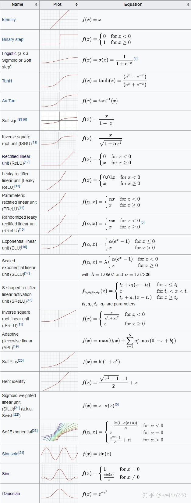

[toc]


# activate

**引入非线性因素。**

在我们面对线性可分的数据集的时候，简单的用线性分类器即可解决分类问题。但是现实生活中的数据往往不是线性可分的，面对这样的数据，一般有两个方法：引入非线性函数、线性变换。

**线性变换**

就是把当前特征空间通过一定的线性映射转换到另一个空间，让数据能够更好的被分类。


# All_func

- [参考](https://zhuanlan.zhihu.com/p/139696588)




# Mish

```python
class Mish(nn.Module):

  def __init__(*self*):

    super(Mish, self).__init__()

  def forward(*self*, *x*):

    return x * torch.tanh(F.softplus(x))
```


