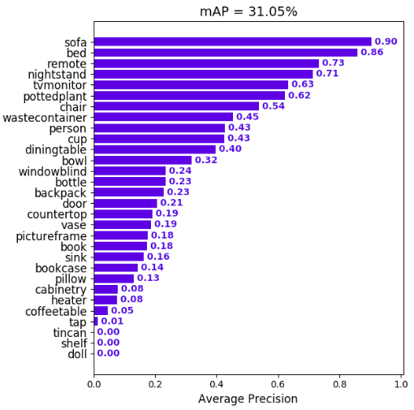

# Calculate AP

For each class:

First, your neural net **detection-results** are sorted by decreasing confidence and are assigned to **ground-truth objects**. We have "a match" when they share the **same label and an IoU >= 0.5** (Intersection over Union greater than 50%). This "match" is considered a true positive if that ground-truth object has not been already used (to avoid multiple detections of the same object).

首先，神经网络的检测结果通过置信度由高到低排序。同标签并且IOU>=0.5则该框被认为是一个true positive

Using this criterium, we calculate the precision/recall curve. E.g:

预测正确的：

1. 类别正确且置信度（confidence）大于一定阈值
2. 预测框与真实框的IOU大于一定阈值(IOU_threshould)

$$
\begin{aligned}

& TP = TruePositive \\
& TN = TrueNegative \\
& FP = FalsePositive \\
& FN = FalseNegative \\
& Precision = \frac{TP}{TP+FP} \\
& Recall    = \frac{TP}{TP+FN} \\
\end{aligned}
$$

计算AP时，首先要将曲线平滑化，然后计算底下的面积：

Then we compute a version of the measured precision/recall curve with **precision monotonically decreasing** (shown in light red), by setting the precision for recall `r` to the maximum precision obtained for any recall `r' > r`.

Finally, we compute the AP as the **area under this curve** (shown in light blue) by numerical integration. No approximation is involved since the curve is piecewise constant.

#  Calculate mAP

We calculate the mean of all the AP's, resulting in an mAP value from 0 to 100%. E.g:

这里计算了单类别的AP值，并计算他们的平均，即MAP （mean AP）

