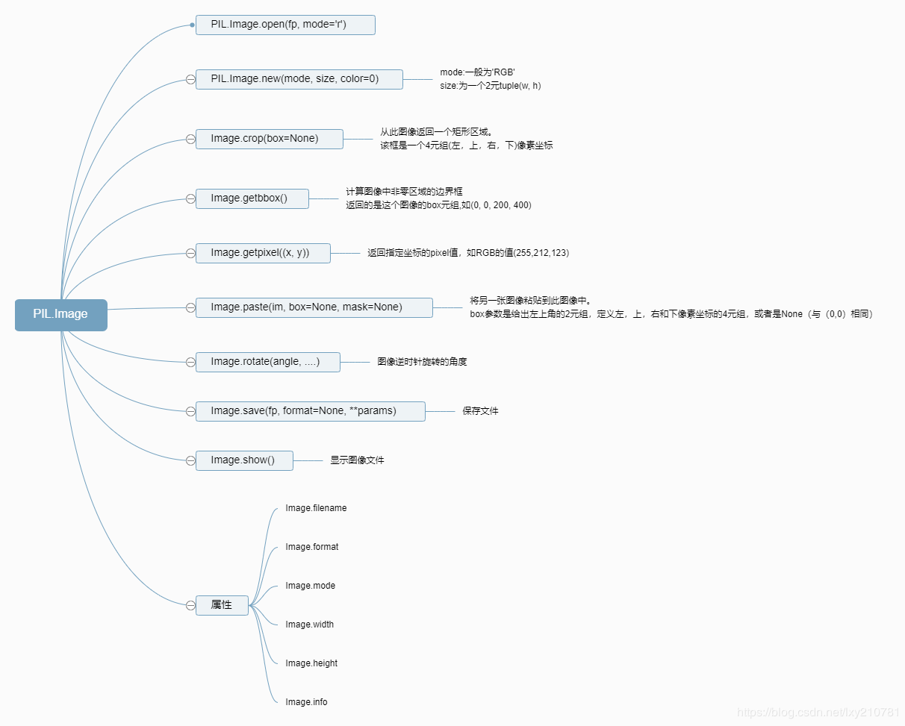

[TOC]

- [文档](https://pillow.readthedocs.io/en/stable/reference/Image.html#PIL.Image.Image.crop)
- [参考1](https://zhuanlan.zhihu.com/p/58671158)  [参考2](https://blog.csdn.net/qq_42227134/article/details/88795363)




# open

```python
from PIL import Image

image = Image.open('python-logo.png')  # 创建图像实例
# 查看图像实例的属性
print(image.format, image.size, image.mode)

image.show() # 显示图像
```


# shape

```python
img.shape = h,w,channel
```


# rotate

```python
from PIL import Image
im = Image.open("cat.jpg")
im.rotate(90).show()
```


# new

使用给定的模式和大小创建新图像。
实例化对象 = Image.new(模式，大小，颜色= 0 )
模式：用于设置新建图片模式[参考位置](https://blog.csdn.net/qq_42227134/article/details/88722776)（RGB、RGBA等）
大小：图像大小（长 X 宽）（分辨率）
颜色： 可以直接填入常用颜色名称
可以填入十六纸质标的的颜色（#FF0099）
可以传入元组，（255，255,255）

```python
from PIL import Image
im = Image.new('RGB', (200, 100), 'red')
im.show()
```

# save

```pytho
im.save('picture.jpg')
```


# info

````python
from PIL import Image
im = Image.open('cat.jpg')
print(im.filename)
print(im.format)
print(im.mode)
print(im.size)
print(im.width)
print(im.height)
print(im.info)


cat.jpg
JPEG
RGB
(1280, 853)
1280
853
{'jfif': 257, 'jfif_version': (1, 1), 'dpi': (72, 72), 'jfif_unit': 1, 'jfif_density': (72, 72)}
````


# copy

```python

from PIL import Image

im = Image.open('cat.jpg')
copy_im = im.copy()
copy_im.show()
```


# crop

- crop()方法用做裁剪图像，该方法需传入矩形元组参数，返回一个新的Image对象，对原图没有影响。

```pytho
from PIL import Image

im = Image.open('cat.jpg')
# 复制
copy_im = im.copy()

# 裁剪图片
crop_im = im.crop((420, 150, 860 , 560))
crop_im.show()
```


# paste

- paste(用来粘贴的图片，(位置坐标))
- 可以通过设置位置坐标来确定粘贴图片的位置
- 注： 该方法没有返回值，直接作用于原图片

```python
from PIL import Image

im = Image.open('cat.jpg')
# 复制
copy_im = im.copy()
# 裁剪图片
crop_im = copy_im.crop((420, 150, 860 , 560))
# 粘贴图片
im.paste(crop_im, (0, 0)) # 左上角原点位置
im.show()

```


# resize

```python
resize(size, resample=BICUBIC, box=None, reducing_gap=None):
:param resample: An optional resampling filter.  This can be one of :py:data:`PIL.Image.NEAREST`, :py:data:`PIL.Image.BOX`,
:py:data:`PIL.Image.BILINEAR`, :py:data:`PIL.Image.HAMMING`,:py:data:`PIL.Image.BICUBIC` or :py:data:`PIL.Image.LANCZOS`.
Default filter is :py:data:`PIL.Image.BICUBIC`.
If the image has mode "1" or "P", it is always set to :py:data:`PIL.Image.NEAREST`.
See: :ref:`concept-filters`.
resized_im = im.resize((width, height))
```


# thumbnail

- resize()与thumbnail()的区别，resize()会改变图片原比例，thumbnail()会根据width属性等比例缩放。

- thumbnail()方法可以用来制作缩略图，可接收二元数组作为缩略图的尺寸，然后将示例缩小到指定尺寸。

  ```
  from PIL import Image
  
  im = Image.open('cat.jpg')
  #获得图像尺寸
  w, h = im.size
  # 缩放到50%
  im.thumbnail((w//3, h//3))
  #显示图片
  im.show()
  
  
  
  ```

# transpose

移调图像（以90度为单位翻转或旋转）

**参数：**
Image.FLIP_LEFT_RIGHT 水平翻转
Image.FLIP_TOP_BOTTOM 垂直翻转
Image.ROTATE_90 旋转90度
Image.ROTATE_180 旋转180度
Image.ROTATE_270 旋转270度
Image.TRANSPOSE 水平翻转并旋转90度
Image.TRANSVERSE 水平翻转并旋转270度

```python
from  PIL import Image

im = Image.open('cat.jpg')
tran_im = im.transpose(Image.FLIP_LEFT_RIGHT)
tran_im.show()

```

# spilt

- split()可以将多通道图片按通道分割为单通道图片。返回各个通道的灰度图组成的元组。
- split()方法返回的是一个元祖，元祖中的元素则是分割后的单个通道的图片。

```python
R, G, B = im.split()
from PIL import Image
# 打开图片
im = Image.open('cat.jpg')
# 获取图片通道名称
get_im = im.getbands()
# 打印通道信息
print(get_im)
# 通过通道分割图片
R,G,B = im.split()
# 展示图片
R.show()
G.show()
B.show()

```


# getchannel

getchannel(channel)可以获取单个通道的图片：

```python
R = im.getchannel("R")

```


# convert

mode - 请求的模式。
matrix - 可选的转换矩阵。如果给定，则应该是包含浮点值的4或12元组。
抖动 - 抖动方法，在从“RGB”模式转换为“P”或从“RGB”或“L”转换为“1”时使用。可用方法为NONE或FLOYDSTEINBERG（默认值）。请注意，在提供矩阵时不使用此选项。
palette - 从“RGB”模式转换为“P”时使用的Palette。可用的调色板是WEB或ADAPTIVE。
colors - 用于自适应调色板的颜色数。默认为256。

```python
img = im.convert("L") 
```

# getpixel

- 使用getpixel(x,y)方法可以获取单个像素位置的值：

  ```
  from PIL import Image
  
  im = Image.open('cat.jpg')
  print(im.getpixel((20,20)))
  img = im.convert('L')
  print(img.getpixel((20,20)))
  
  (186, 123, 54)
  133
  注：L模式经常用来处理图像识别，数据方便分析处理
  ```