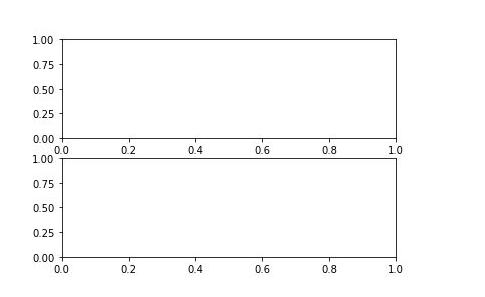
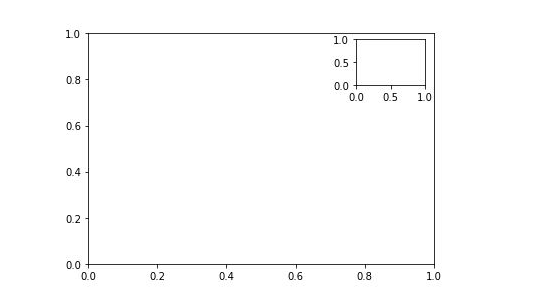

# cn

```python
plt.rcParams['font.sans-serif']=['SimHei'] #用来正常显示中文标签
plt.rcParams['axes.unicode_minus']=False #用来正常显示负号
```


# figure

- [参考](https://blog.csdn.net/The_Time_Runner/article/details/89292835)
- **dpi** 像素
- **figsize** 尺寸
- **facecolor** 图像颜色
- **edgecolor** 边框颜色
- **linewidth** 边框线宽

```python
class matplotlib.figure.Figure(figsize=None, dpi=None, facecolor=None, edgecolor=None, linewidth=0.0, frameon=None, subplotpars=None, tight_layout=None, constrained_layout=None)


fig_height = fig.get_figheight()
fig_width = fig.get_figwidth()

```


# set figure's size and name

```python
import matplotlib.pyplot as plt
import numpy as np
fig = plt.figure(figsize=(6, 3))
fig.canvas.set_window_title('I am title')
x = np.linspace(0, 10, 100)
plt.plot(x, np.sin(x))
plt.show()
```

- demo2

```python
r = fig.canvas.get_renderer()
t = plt.text(val, i, tp_str_val, color='forestgreen', va='center', fontweight='bold')
def adjust_axes(r, t, fig, axes):
    # get text width for re-scaling
    bb = t.get_window_extent(renderer=r)
    text_width_inches = bb.width / fig.dpi
    # get axis width in inches
    current_fig_width = fig.get_figwidth()
    new_fig_width = current_fig_width + text_width_inches
    propotion = new_fig_width / current_fig_width
    # get axis limit
    x_lim = axes.get_xlim()
    axes.set_xlim([x_lim[0], x_lim[1]*propotion])

```


# plt.text

- [参考](https://blog.csdn.net/TeFuirnever/article/details/88947248)
- x,y:表示坐标值上的值
- string:表示说明文字
- fontsize:表示字体大小
- verticalalignment：垂直对齐方式 ，参数：[ ‘center’ | ‘top’ | ‘bottom’ | ‘baseline’ ]
- horizontalalignment：水平对齐方式 ，参数：[ ‘center’ | ‘right’ | ‘left’ ]

```python
plt.text(x,
	y,
	string,
	fontsize=15,
	verticalalignment="top",
	horizontalalignment="right"
)


import matplotlib.pyplot as plt

fig = plt.figure()
plt.axis([0, 10, 0, 10])
t = "This is a really long string that I'd rather have wrapped so that it"\
    " doesn't go outside of the figure, but if it's long enough it will go"\
    " off the top or bottom!"
plt.text(4, 1, t, ha='left', rotation=15, wrap=True)
plt.text(6, 5, t, ha='left', rotation=15, wrap=True)
plt.text(6, 5, t, ha='left', rotation=15, wrap=False)
plt.show()

```


# plt.gca() plt.gcf()

```python
第一种代码：

import matplotlib.pyplot as plt

fig = plt.figure()
ax = fig.add_subplot(111)

rect = plt.Rectangle((0.1,0.1),0.5,0.3)
ax.add_patch(rect)

plt.show()

第二种代码：

import matplotlib.pyplot as plt

fig = plt.figure()　　#创建图
ax = fig.add_subplot(111)  #创建子图

plt.gca().add_patch(plt.Rectangle((0.1,0.1),0.5,0.3))
plt.show()
```


# plt.scatter

```python
import matplotlib.pyplot as plt
plt.scatter(x,y,s=20, c='b', marker = '0', cmap = None, norm = None, vmin = None, alpha = None, linewidths = None, verts = None, hold = None, **kwargs)

plt.figure(figsize=(10,10))
plt.scatter(np_df[0,0], np_df[0,1], color = 'r',marker ='o')
plt.scatter(np_df[1:,0], np_df[1:,1],marker ='o')
for i in range(np_df.shape[0]):
    t_x, t_y = float(np_df[i,0]) + 0.000001, float(np_df[i, 1]) + 0.0003
    plt.annotate(str(i), xy = (np_df[i,0], np_df[i, 1]), xytext = (t_x, t_y))

#plt.colorbar()
plt.grid(True)
plt.xlabel('经度')
plt.ylabel('纬度')
plt.savefig('sensor_sit.png')
plt.show()
```


# figure.canvas.get_renderer

- [参考](https://www.codenong.com/22667224/)

- 确定文本的尺寸

```python

import matplotlib as plt

f = plt.figure()
r = f.canvas.get_renderer()
t = plt.text(0.5, 0.5, 'test')

bb = t.get_window_extent(renderer=r)
width = bb.width
height = bb.height
```


# axes and subplot

- [参考](https://www.zhihu.com/question/51745620)

```python
fig = plt.figure()
ax1 = fig.add_subplot(211)
ax2 = fig.add_subplot(212)
plt.show()
```



```python
fig = plt.figure()
ax3 = fig.add_axes([0.1,0.1,0.8,0.8])
ax4 = fig.add_axes([0.72,0.72,0.16,0.16])
plt.show()
```




# axes.Axes.get_xlim

```python
get_xlim返回当前Axes视图的x的上下限, get_ylim同.

# return
left, right(float, float)
The current x-axis limits in data coordinates.
```


# subplots_adjust

```python
matplotlib.pyplot.subplots_adjust(*args, **kwargs)
subplots_adjust(left=None, bottom=None, right=None, top=None,
                wspace=None, hspace=None)

left  = 0.125  # 子图(subplot)距画板(figure)左边的距离
right = 0.9    # 右边
bottom = 0.1   # 底部
top = 0.9      # 顶部
wspace = 0.2   # 子图水平间距
hspace = 0.2   # 子图垂直间距
```


