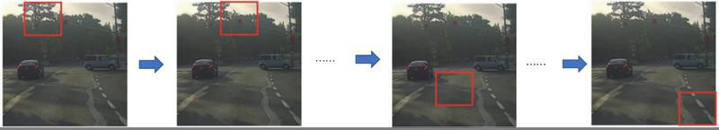

[TOC]

## 简介

### yolo与传统的检测算法的不同 

-  yolo把目标简介转化为一个回归问题，与传统的分类检测不同，yolo是one-stage的。每次预测中，用单独的神经网络预测全图的bounding box和分类的可能性。当检测的是一个单独的网络时，它可以直接对检测性能进行端到端的最优化
- 传统的检测方法是基于Region Proposal，如R-CNN系列，它们是two-stage的，需要先用启发式的方法（selective search）或者CNN网络(RPN)产生Region Proposal，然后再在Region Proposal上作分类和回归。

### 滑动窗口与CNN

- 采用滑动窗口的目标检测算法思路非常简单，它将检测问题转化为了图像分类问题。
- 其基本原理就是采用不同大小和比例（宽高比）的窗口在整张图片上以一定的步长进行滑动，然后对这些窗口对应的区域做图像分类，这样就可以实现对整张图片的检测了。如DPM就是采用这种思路。
- 缺点：
  -  不知道要检测的目标大小是什么规模，所以要设置不同大小和比例的窗口去滑动，而且还要选取合适的步长。
  - 滑动会产生很多的子区域，并且都要经过分类器去做预测，这需要很大的计算量，所以你的分类器不能太复杂，因为要保证速度。
  - 解决思路之一就是减少要分类的子区域，这就是R-CNN的一个改进策略，其采用了selective search方法来找到最有可能包含目标的子区域（Region Proposal），其实可以看成采用启发式方法过滤掉很多子区域，这会提升效率。

- **滑动窗口图片**

- 全卷积网络（FCN）：全卷积网络通过转置卷积（transposed convolution）层将中间层特征图的高和宽变换回输入图像的尺寸，从而令预测结果与输入图像在空间维（高和宽）上一一对应：给定空间维上的位置，通道维的输出即该位置对应像素的类别预测。尽管可以减少滑动窗口的计算量，但是只是针对一个固定大小与步长的窗口，这是远远不够的。

## yolo设计理念

