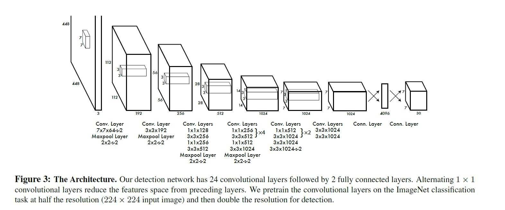

[TOC]

## 简介

### yolo与传统的检测算法的不同 

-  yolo把目标简介转化为一个回归问题，与传统的分类检测不同，yolo是one-stage的。每次预测中，用单独的神经网络预测全图的bounding box和分类的可能性。当检测的是一个单独的网络时，它可以直接对检测性能进行端到端的最优化
- 传统的检测方法是基于Region Proposal，如R-CNN系列，它们是two-stage的，需要先用启发式的方法（selective search）或者CNN网络(RPN)产生Region Proposal，然后再在Region Proposal上作分类和回归。

### 滑动窗口与CNN

- 采用滑动窗口的目标检测算法思路非常简单，它将检测问题转化为了图像分类问题。
- 其基本原理就是采用不同大小和比例（宽高比）的窗口在整张图片上以一定的步长进行滑动，然后对这些窗口对应的区域做图像分类，这样就可以实现对整张图片的检测了。如DPM就是采用这种思路。
- 缺点：
  -  不知道要检测的目标大小是什么规模，所以要设置不同大小和比例的窗口去滑动，而且还要选取合适的步长。
  - 滑动会产生很多的子区域，并且都要经过分类器去做预测，这需要很大的计算量，所以你的分类器不能太复杂，因为要保证速度。
  - 解决思路之一就是减少要分类的子区域，这就是R-CNN的一个改进策略，其采用了selective search方法来找到最有可能包含目标的子区域（Region Proposal），其实可以看成采用启发式方法过滤掉很多子区域，这会提升效率。

- **滑动窗口图片**

- 全卷积网络（FCN）：全卷积网络通过转置卷积（transposed convolution）层将中间层特征图的高和宽变换回输入图像的尺寸，从而令预测结果与输入图像在空间维（高和宽）上一一对应：给定空间维上的位置，通道维的输出即该位置对应像素的类别预测。尽管可以减少滑动窗口的计算量，但是只是针对一个固定大小与步长的窗口，这是远远不够的。

## yolo设计理念

- 将图片分成$S \times S$ 的网格，如果目标对象的中心落在某个单元格，那么该单元格就要负责检测那个对象
- 每个单元格会预测数个bounding boxes 出来，并且为这些box各自附上一个confidence score，confidence scores反映了box包含了一个对象并且box的accuracy，把confidence定义为 $Pr(Object) * IOU^{truth}_{pred}$ ,confidece包含两个方面，一个是这个边界框含有目标的可能性大小，二是这个边界框的准确度。前者为$Pr(Object)$ ，当边界框是背景时（即不包含目标），此时$Pr(Object)=0$ ,而包含目标时则为1。边界框的准确度用IOU来检测。
- 每一个bounding box 右五个预测值组成：x，y，w，h，confidence。(x，y)坐标表示box的中心，(x，y)是相对于每个单元格左上角坐标点的偏移值。width和height是box的宽和长，但是值是相对于整个图片的宽与高的比例，这样子前4个元素的大小在$[0,1]$ 。confidence表示predicted box和any ground truth box 之间的IOU
- 分类问题：每个单元格预测 $ C$  个类别的概率值，$ Pr(Class_i|Object)$ 这些概率值取决于包含该对象的单元格。不管一个单元格预测多少个边界框，其只预测一组类别概率值，这是Yolo算法的一个缺点。
- 现在可以得到各个边界框的类别置信度（class-confidence scores）,这些socres同时编码了box类别的概率和box的accuracy
  - $Pr(Class_i|Object) * Pr(Object) * IOU^{truth}_pred = Pr(Class_i) * IOU^{truth}_{pred}  (1)$

- 图中的预测被编码为一个tensor,它的形状为
  - $S \times S \times(B*5+C)$

- 在PASCAL VOC上评估YOLO， 使用S = 7，B = 2。PASCAL VOC有20个被标记的classes ，所以C = 20。所以最后的预测是一个7 * 7 * 30的tensor

## 网络设计

.

