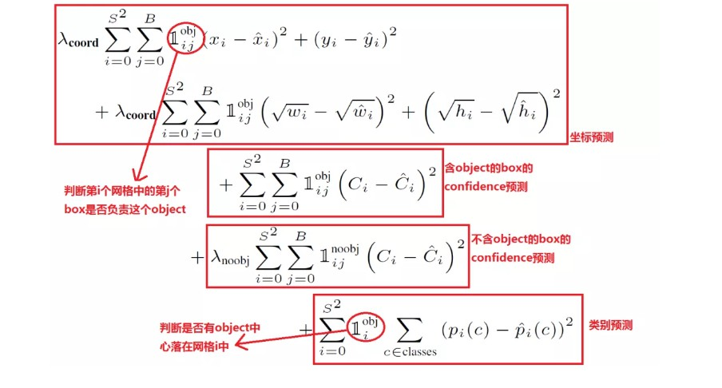

[TOC]

- 论文链接：http://arxiv.org/abs/1506.02640
- 代码下载：https://github.com/pjreddie/darknet
- 翻译参考：
  - https://mp.weixin.qq.com/s/E12qr8Z4PkeBE7B90A8Tvg
  - https://zhuanlan.zhihu.com/p/32525231

## 简介

### yolo与传统的检测算法的不同 

-  yolo把目标简介转化为一个回归问题，与传统的分类检测不同，yolo是one-stage的。每次预测中，用单独的神经网络预测全图的bounding box和分类的可能性。当检测的是一个单独的网络时，它可以直接对检测性能进行端到端的最优化
- 传统的检测方法是基于Region Proposal，如R-CNN系列，它们是two-stage的，需要先用启发式的方法（selective search）或者CNN网络(RPN)产生Region Proposal，然后再在Region Proposal上作分类和回归。

### 滑动窗口与CNN

- 采用滑动窗口的目标检测算法思路非常简单，它将检测问题转化为了图像分类问题。
- 其基本原理就是采用不同大小和比例（宽高比）的窗口在整张图片上以一定的步长进行滑动，然后对这些窗口对应的区域做图像分类，这样就可以实现对整张图片的检测了。如DPM就是采用这种思路。
- 缺点：
  -  不知道要检测的目标大小是什么规模，所以要设置不同大小和比例的窗口去滑动，而且还要选取合适的步长。
  - 滑动会产生很多的子区域，并且都要经过分类器去做预测，这需要很大的计算量，所以你的分类器不能太复杂，因为要保证速度。
  - 解决思路之一就是减少要分类的子区域，这就是R-CNN的一个改进策略，其采用了selective search方法来找到最有可能包含目标的子区域（Region Proposal），其实可以看成采用启发式方法过滤掉很多子区域，这会提升效率。

- **滑动窗口图片**

- 全卷积网络（FCN）：全卷积网络通过转置卷积（transposed convolution）层将中间层特征图的高和宽变换回输入图像的尺寸，从而令预测结果与输入图像在空间维（高和宽）上一一对应：给定空间维上的位置，通道维的输出即该位置对应像素的类别预测。尽管可以减少滑动窗口的计算量，但是只是针对一个固定大小与步长的窗口，这是远远不够的。

## yolo设计理念

- 将图片分成$S \times S$ 的网格，如果目标对象的中心落在某个单元格，那么该单元格就要负责检测那个对象
- 每个单元格会预测数个bounding boxes 出来，并且为这些box各自附上一个confidence score，confidence scores反映了box包含了一个对象和box的accuracy，把confidence定义为 $Pr(Object) * IOU^{truth}_{pred}$ ,confidece包含两个方面，一个是这个边界框含有目标的可能性大小，二是这个边界框的准确度。前者为$Pr(Object)$ ，当边界框是背景时（即不包含目标），此时$Pr(Object)=0$ ,而包含目标时则为1。边界框的confidence用IOU来表示。
- 每一个bounding box 右五个预测值组成：x，y，w，h，confidence。(x，y)坐标表示box的中心，(x，y)是相对于每个单元格左上角坐标点的偏移值。width和height是box的宽和长，但是值是相对于整个图片的宽与高的比例，这样子前4个元素的大小在$[0,1]$ 。confidence表示predicted box和any ground truth box 之间的IOU
- 分类问题：每个单元格预测 c 个类别的概率值，$ Pr(Class_i|Object)$ 这些概率值取决于包含该对象的单元格。不管一个单元格预测多少个边界框，其只预测一组类别概率值，这是Yolo算法的一个缺点。
- 现在可以得到各个边界框的类别置信度（class-confidence scores）,这些socres同时编码了box类别的概率和box的accuracy
  - $Pr(Class_i|Object) * Pr(Object) * IOU^{truth}_{pred} = Pr(Class_i) * IOU^{truth}_{pred}  (1)$
  - 得到每个box的class-specific confidence score以后，设置阈值，滤掉得分低的boxes，对保留的boxes进行NMS处理，就得到最终的检测结果。

- 图中的预测被编码为一个tensor,它的形状为
  - $S \times S \times(B*5+C)$

- 在PASCAL VOC上评估YOLO， 使用S = 7，B = 2。PASCAL VOC有20个被标记的classes ，所以C = 20。所以最后的预测是一个7 * 7 * 30的tensor

### 网络设计

.

- 网络的初始卷积层提取图片的的特征，全连接层预测输出的概率和坐标
- 网络用GoogLeNet模型来对图片分类，网络有24个卷积层，并且紧跟着两个全连接层，接着用1 * 1的卷积层，然后是3*3的卷积层。对于卷积层和全连接层，采用Leaky ReLU激活函数：$ max(x,0.1x)$。但是最后一层却采用线性激活函数。
- YOLO的快速版本只有9个卷积层
- 对于每一个单元格，输出$7 \times 7 \times 30$前20个元素是类别概率值，然后2个元素是边界框置信度，两者相乘可以得到类别置信度，最后8个元素是边界框的$(x,y,w,h)$ 。为了计算方便，对于边界框把置信度 $C$  **即IOU**和 $(x,y,w,h)$ 都分开排列，而不是按照$(x,y,w,h,C)$ 这样排列。因为实际上这30个元素都是对应一个单元格，其排列是可以任意的。但是分离排布，可以方便地提取每一个部分。这里来解释一下，首先网络的预测值是一个二维张量 $P$ ，其shape为 $[barch,7 \times 7 \times 30]$。采用切片，那么 $P_{[:,7 *7*20]}$就是类别概率部分，而 $P_{[:,7*7*20:7*7*(20+2)]}$是置信度部分，最后剩余部分 $P_{[:,7*7*(20+2):]}$ 是边界框的预测结果。这样，提取每个部分是非常方便的，这会方面后面的训练及预测时的计算。

### Training

- 在ImageNet 1000-class competition dataset上预训练卷积层。为了预训练，使用前20个卷积层，然后接着一个average-poolig层和一个全连接层
- 预训练之后，加上四个卷积层和两个全连接层，它们带有随机初始化的值。检测通常需要细粒度化的视觉信息，所以把图片从224*224 增加到448 * 448
- 最后一层同时预测类别概率和box坐标。用图片的width和height对box的width和height进行正则化，所以它们的值在 $[0,1]$之间。将边界框x和y坐标参数化为网格单元位置的偏移量，因此它们也在0和1之间有界。
- 最后一层使用线性激活函数，其他层使用下面的泄漏整流线性激活函数

​														$$ \phi(x) = \begin{cases}x \text{,        if  x > 0} \\ 0.1x \text{,   otherwise}\end{cases} $$（2）

- 由于平方和误差容易最优化，所以将其作为loss，然而它不能完全符合我们最大化 average precision的目标。它对定位误差和分类误差的权重相等，但分类误差可能不是最理想的。并且，在每一张图片中，许多单元格并没有包含对象，这使得 confidence socres 变成0，通常会压到没有包含对象格的梯度。这可能会导致模型不稳定，导致训练在早期出现分歧。为了解决loss的问题，增加来自box坐标预测的loss并且减少**对没有包含对象**的格子来自置信预测的loss，使用两个参数 $\lambda_{coord}$和$\lambda_{noobj}$ 来完成，设置$\lambda_{coord} = 5$ 和$\lambda_{noobj}= 0.5$ 。其他权重值均为1。
- 平方和误差相当于large box 和 small box 中的weights errors 。对不同大小的box预测中，相比于大box预测偏一点，小box预测偏一点肯定更不能被忍受的。而sum-square error loss中对同样的偏移loss是一样。为了部分解决这个问题，**我们预测边界框的宽度和高度的平方根**，而不是直接预测宽度和高度，即最后预测值变为$(x, y,\sqrt{w},\sqrt{h})$ ，如果一个单元格内存在多个目标，这时候Yolo算法就只能选择其中一个来训练，这也是Yolo算法的缺点之一。
- 选择 IOU值最高的box作为某个单元格预测的box。
- 对以下的loss function进行最优化
  - 第一项是边界框中心坐标的误差项，第二项是边界框的高与宽的误差项，第三项是包含目标的边界框的置信度误差项。第四项是不包含目标的边界框的置信度误差项。而最后一项是包含目标的单元格的分类误差项。
  - $1^{obj}_i$ 表示对象在单元格 $i$ 中，$1^{obj}_{ij}$ 表明第 $j$ 个box预测器是否在该次预测中负责
  - loss function 只在对象出现在单元格时才惩罚分类误差，它也只惩罚边界框坐标错误，如果预测器是“负责”为地面真相框
  - 置信度target值 $C_i$ , 如果不存在目标，此时由于 $Pr(object)=0$，那么$C_i = 0$。如果存在目标，$Pr(object)=1$，此时需要确定 $IOU^{truth}_{pred}$ ,希望最好的话，可以将IOU取1，这样$C_i = 1$,但是在YOLO实现中，使用了一个控制参数rescore（默认为1），当其为1时，IOU不是设置为1，而就是计算truth和pred之间的真实IOU。

- 原文在网络上训练了135个epoch。在training中使用 batch为64，momentum为0.9，decay为0.0005
- 学习率的规则为：
  - 慢慢从$10^{-3}$ 增加到 $10^{-2}$ 
  - 持续用 $10^{-2}$  训练75个epoch，用$10^{-3}$ 训练30个epoch，最后用$10^{-4}$训练30个epoch
- 为了避免过拟合，使用dropout和广泛的数据扩充，dropout =0.5，阻止了层之间的相互适应。对于数据扩充，引入随机缩放和高达原始图像大小20%的平移；在HSV颜色空间，随机调整曝光和饱和度的图像高达1.5的因素。

### Testing

- 非极大值抑制算法（non maximum suppression, NMS），这个算法不单单是针对Yolo算法的，而是所有的检测算法中都会用到。NMS算法主要解决的是一个目标被多次检测的问题，如图中人脸检测，可以看到人脸被多次检测，但是其实我们希望最后仅仅输出其中一个最好的预测框，比如对于美女，只想要红色那个检测结果。那么可以采用NMS算法来实现这样的效果：**首先从所有的检测框中找到置信度最大的那个框，然后挨个计算其与剩余框的IOU，如果其值大于一定阈值（重合度过高），那么就将该框剔除；然后对剩余的检测框重复上述过程，直到处理完所有的检测框。Yolo预测过程也需要用到NMS算法。**

- Yolo的预测：输入一张图片，最终的输出是 $7\times7\times30$ ,分割成三个部分，类别概率为 $[7,7,20]$ ,置信度部分为$[7,7,2]$，边界框部分为$[7,7,2,4]$ （对于这部分不要忘记根据原始图片计算出真实值）。将前两个部分相乘(矩阵$[7,7,20]$ 乘以 $[7,7,2]$ 可以各补一个维度来完成 $[7,7,1,20] \times [7,7,2,1]$) 可以得到类别置信度为 $[7,7,2,20]$， 这里总共预测了7 * 7 * 2  = 98个边界框
- 首先，对于每个预测框根据类别置信度选取置信度最大的那个类别作为其预测标签，经过这层处理我们得到各个**预测框的预测类别及对应的置信度值**，其大小都是$[7,7,2] $ 。一般情况下，会设置置信度阈值，就是将置信度小于该阈值的box过滤掉，所以经过这层处理，剩余的是置信度比较高的预测框。**最后再对这些预测框使用NMS算法**，最后留下来的就是检测结果。一个值得注意的点是N**MS是对所有预测框一视同仁，还是区分每个类别，分别使用NMS**。Ng在deeplearning.ai中讲应该区分每个类别分别使用NMS，但是看了很多实现，其实还是同等对待所有的框，可能是不同类别的目标出现在相同位置这种概率很低吧。
- 对于Yolo算法，其却采用了另外一个不同的处理思路，其区别就是先使用NMS，然后再确定各个box的类别。其基本过程如图所示。对于98个boxes，首先将小于置信度阈值的值归0，然后分类别地对置信度值采用NMS，这里NMS处理结果不是剔除，而是将其置信度值归为0。最后才是确定各个box的类别，当其置信度值不为0时才做出检测结果输出。这个策略不是很直接，但是貌似Yolo源码就是这样做的。Yolo论文里面说NMS算法对Yolo的性能是影响很大的，所以可能这种策略对Yolo更好。

### 算法性能分析

- 这里Yolo与其它检测算法做了对比，包括DPM，R-CNN，Fast R-CNN以及Faster R-CNN。其对比结果如表1所示。与实时性检测方法DPM对比，可以看到Yolo算法可以在较高的mAP上达到较快的检测速度，其中Fast Yolo算法比快速DPM还快，而且mAP是远高于DPM。但是相比Faster R-CNN，Yolo的mAP稍低，但是速度更快。

- yolo 定位目标做的比较不好。定位错误的超过其他的错误的总和。Fast R-CNN 定位的错误比yolo少，但是与背景的区分度错误却比yolo多。

- Correct：类别正确，IOU>0.5；（准确度）

- Localization：类别正确，0.1 < IOU<0.5（定位不准）；
- Similar：类别相似，IOU>0.1；
- Other：类别错误，IOU>0.1；
- Background：对任何目标其IOU<0.1。（误把背景当物体）