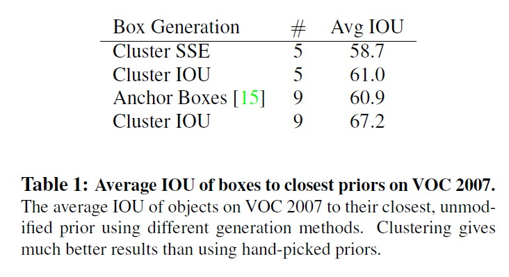
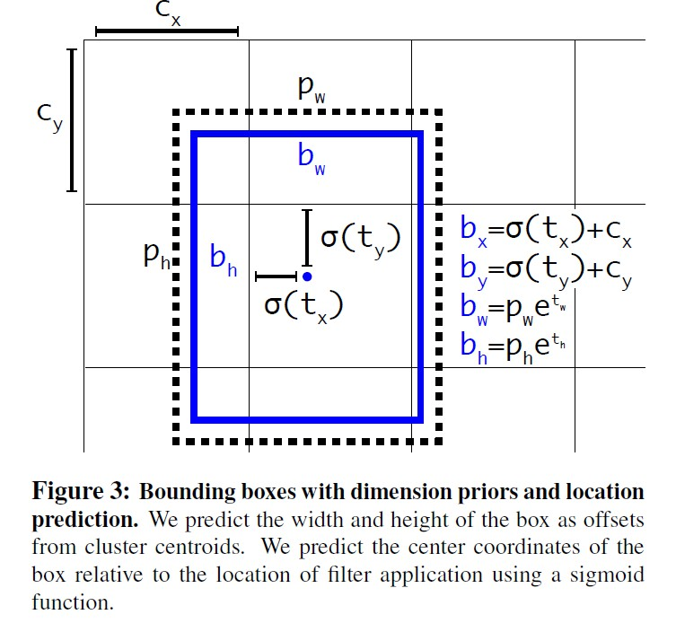

[TOC]

## 简介

- 大多数检测方法仍然局限于一小部分对象。
- 与分类和标记的数据集比较起来，现在对象检测的数据集还是有限的。

### 锚框简介

- 参考链接：https://tangshusen.me/Dive-into-DL-PyTorch/#/chapter09_computer-vision/9.4_anchor
- PyTorch做检测:https://github.com/sgrvinod/a-PyTorch-Tutorial-to-Object-Detection
- 目标检测算法通常会在输入图像中采样大量的区域，然后判断这些区域中是否包含我们感兴趣的目标，并调整区域边缘从而更准确地预测目标的真实边界框（ground-truth bounding box）。不同的模型使用的区域采样方法可能不同。这里我们介绍其中的一种方法：它以每个像素为中心生成多个大小和宽高比（aspect ratio）不同的边界框。这些边界框被称为锚框（anchor box）。
- 假设输入图像高为*h*，宽为*w*。我们分别以图像的每个像素为中心生成不同形状的锚框。设大小为$s∈(0,1]$且宽高比为$r>0$，那么锚框的宽和高将分别为$ws\sqrt{r}$和$hs\sqrt{r}$。当中心位置给定时，已知宽和高的锚框是确定的。
- 下面我们分别设定好一组大小$s_1,\ldots,s_n$和一组宽高比$r_1,\ldots,r_m$。如果以每个像素为中心时使用所有的大小与宽高比的组合，输入图像将一共得到$whnm$个锚框。虽然这些锚框可能覆盖了所有的真实边界框，但计算复杂度容易过高。因此，我们通常只对包含$s_1$或$r_1$的大小与宽高比的组合感兴趣，即
  - $(s_1,r_1),(s_1,r_2), \ldots (s_1,r_m),(s_2,r_1),(s_3,r_1),\ldots (s_n,r_1)$
- 也就是说，以相同像素为中心的锚框的数量为$n+m−1$。对于整个输入图像，我们将一共生成$wh(n+m−1)$个锚框。

> 注: PyTorch官方在[torchvision.models.detection.rpn](https://github.com/pytorch/vision/blob/master/torchvision/models/detection/rpn.py)里有一个AnchorGenerator类可以用来生成anchor

### K-means

- k-means是划分方法中较经典的聚类算法之一。由于该算法的效率高，所以在对大规模数据进行聚类时被广泛应用。目前，许多算法均围绕着该算法进行扩展和改进。
- k-means算法以k为参数，把n个对象分成k个簇，使簇内具有较高的相似度，而簇间的相似度较低。k-means算法的处理过程如下：首先，随机地 选择k个对象，每个对象初始地代表了一个簇的平均值或中心;对剩余的每个对象，根据其与各簇中心的距离，将它赋给最近的簇;然后重新计算每个簇的平均值。 这个过程不断重复，直到准则函数收敛。通常，采用平方误差准则，其定义如下：

$$
E=\sum_{i=1}^{k}\sum_{p\in C_i}\left\|p-m_i\right\|^2
$$

- 　这里E是数据中所有对象的平方误差的总和，p是空间中的点，$m_i$是簇$C_i$的平均值[9]。该目标函数使生成的簇尽可能紧凑独立，使用的距离度量是欧几里得距离，当然也可以用其他距离度量。

**算法流程**：
​    输入：包含n个对象的数据和簇的数目k；
​    输出：n个对象到k个簇，使平方误差准则最小。
​    步骤：
　　(1) 任意选择k个对象作为初始的簇中心；
　　(2) 根据簇中对象的平均值，将每个对象(重新)赋予最类似的簇；
　　(3) 更新簇的平均值，即计算每个簇中对象的平均值；
　　(4) 重复步骤(2)、(3)直到簇中心不再变化；

### yolo的变化

- Batch Normalization（批量归一化）: 在所有的卷积层中加入 batch normalization，并得到2%mAP的改善。有了batch normalization 就可以去掉dropout，并且不会造成过拟合
- High Resolution Classifier（高分辨率的分类器）：
  - 所有表现很好的检测方法在ImageNet上使用预训练的分类器。从alexnet开始，大多数的分类器在小于256*256的图片上计算。初始的yolo在224 * 224上的图片上训练，并增加分辨率到448来检测。这就意味着网络需要同时能够学习目标检测并且适应新输入的分辨率（448）
  - 在yolov2上，首次在ImageNet上将分类网络在十个epochs将分辨率调整到448 * 448，这给了网络时间去适应他的过滤器来使得能够处理搞分辨率的输入。

- 带有anchor box 的卷积：

  - 在yolo中去掉了全连接层，并且使用锚框来预测边界框。消除一个池化层，使网络的卷积层的输出具有更高的分辨率。
  - 缩小网络，使其能够计算416的输入图片，而不是448*448，这样做是为了在特征图中得到奇数的位置，这样就特征图就只有一个中心。在目标中，特别是大目标，有占领图片中心的趋势，所以有一个中心的单独位置来预测这些对象是比较好的，相比相邻的用四个定位。
  - yolo的卷积层使得图片缩小了32倍，输入一张416的图片，我们可以得到一张13*13的特征图
  - 将类别预测机制从空间定位中分离，并且为每个锚框预测类别和对象。对象性预测仍然预测ground truth和预测box的IOU，而类预测则预测给定一个对象的类的条件概率。带有锚框的yolo预测了不止一千个box。

- Dimension Clusters（yolo在使用anchor box时遭遇了两个问题，第一个是：box的大小是手动输入的）：

  - box的大小是手动输入的，网络可以学习去调整出适合的box，但如果我们为网络选择更好的先验，我们可以让网络更容易地学会预测好的检测

  - 去除手动选择先验，在训练集的bounding box上使用k-means集群来自动寻找比较好的先验。如果使用欧几里得距离的标准距离，large box 会比 small box 有更多的error，然而我们yolo想要的是比较好的 IOU scores，与box的大小无关。因此，对于距离度量使用

  - $d(box,centroid) = 1 - IOU(box,centroid)$

  - 下表中，比较了使用平均误差（SSE : error sum of suqares）、和上面距离度量的 k-means，以及手动输入的anchor boxes，从表中可以看出，使用IOU-k-means获得5个先验（5种长宽比的锚框）的情况和使用9个手动输入的情况差不多，但是当使用IOU-k-means来获得9个先验时，avg IOU 比手动输入anchor box 高很多。

    

- Direct location prediction（使用anchor box 遇到的第二个问题 ：模型的不稳定性）：

  - 大多数的不稳定性来自于预测 box的位置 $(x，y)$  。在区域提议网络中，网络预测 values  $t_x$ 和 $t_y$ 并且中心坐标 $(x, y)$ 被定义为

  ​          
  $$
  x = (t_x * w_{\alpha}) - x_{\alpha}\\
  y = (t_y * h_{\alpha}) - y_{\alpha}
  $$
  

  - 例如：一个预测 $t_x = 1$ 将会把box 移动到 anchor box 宽的右边， 预测如果为$t_x = -1$ 将会把box 移动到左边。此公式不是强制性的，所以anchor box 最终可以出现在 image 的任何地方，不管box的位置是什么。
  - yolov2并没有和区域提议网络一样，预测中心坐标相对于真实中心坐标的偏移值，而是跟yolo中一样，预测相对于网格单元的位置坐标。这使得值降到了0和1之间。并使用逻辑激活来限制网络的预测在这个范围。
  - 网络在输出的特征图的每个单元中预测了五个 bounding box ，网络给每个bounding box 预测了5个坐标 $t_x, t_y, t_w, t_h,t_o $ 如果单元格从图片的左上角偏移了 $(c_x, c_y)$ ， 并且优先的bounding box 有 width  和 height $p_w, p_h$，然后预测关联到：

$$
b_x = \sigma(t_x) + c_x \\
b_y = \sigma(t_y) + c_y \\
b_w = p_w e^{t_w} \\
b_h = p_h e^{t_h} \\
Pr(object) * IOU(b, object) = \sigma(t_o)
$$

