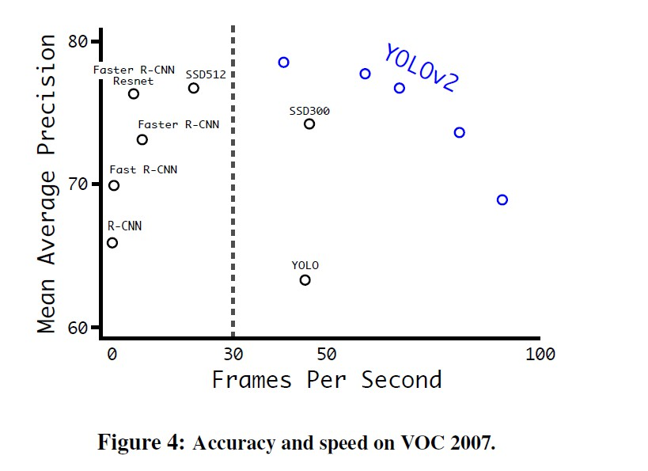
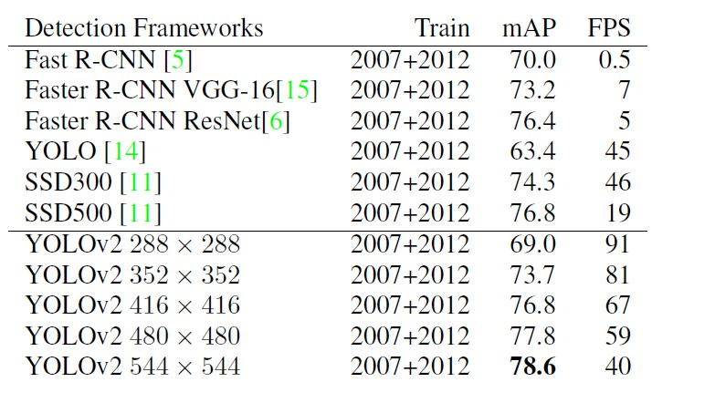
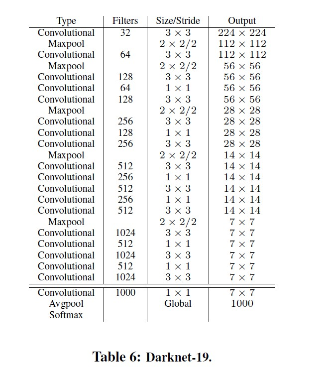
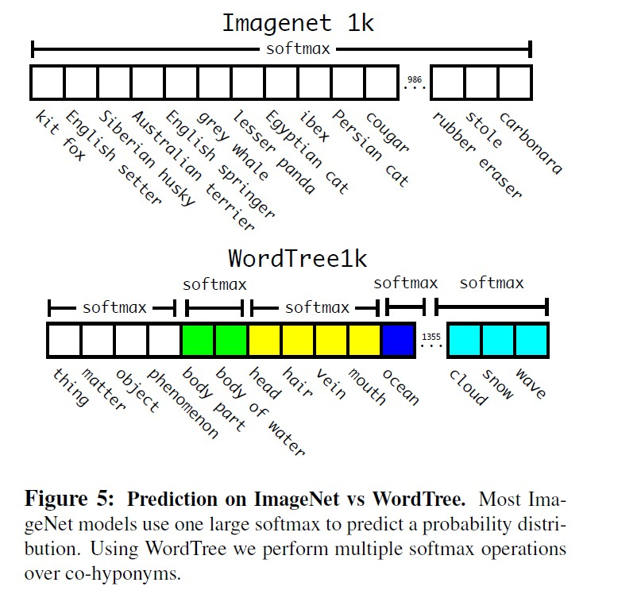

[TOC]

## 简介

- 大多数检测方法仍然局限于一小部分对象。
- 与分类和标记的数据集比较起来，现在对象检测的数据集还是有限的。

## 锚框简介

- 参考链接：https://tangshusen.me/Dive-into-DL-PyTorch/#/chapter09_computer-vision/9.4_anchor
- PyTorch做检测:https://github.com/sgrvinod/a-PyTorch-Tutorial-to-Object-Detection
- 目标检测算法通常会在输入图像中采样大量的区域，然后判断这些区域中是否包含我们感兴趣的目标，并调整区域边缘从而更准确地预测目标的真实边界框（ground-truth bounding box）。不同的模型使用的区域采样方法可能不同。这里我们介绍其中的一种方法：它以每个像素为中心生成多个大小和宽高比（aspect ratio）不同的边界框。这些边界框被称为锚框（anchor box）。
- 假设输入图像高为*h*，宽为*w*。我们分别以图像的每个像素为中心生成不同形状的锚框。设大小为$s∈(0,1]$且宽高比为$r>0$，那么锚框的宽和高将分别为$ws\sqrt{r}$和$hs\sqrt{r}$。当中心位置给定时，已知宽和高的锚框是确定的。
- 下面我们分别设定好一组大小$s_1,\ldots,s_n$和一组宽高比$r_1,\ldots,r_m$。如果以每个像素为中心时使用所有的大小与宽高比的组合，输入图像将一共得到$whnm$个锚框。虽然这些锚框可能覆盖了所有的真实边界框，但计算复杂度容易过高。因此，我们通常只对包含$s_1$或$r_1$的大小与宽高比的组合感兴趣，即
  - $(s_1,r_1),(s_1,r_2), \ldots (s_1,r_m),(s_2,r_1),(s_3,r_1),\ldots (s_n,r_1)$
- 也就是说，以相同像素为中心的锚框的数量为$n+m−1$。对于整个输入图像，我们将一共生成$wh(n+m−1)$个锚框。

> 注: PyTorch官方在[torchvision.models.detection.rpn](https://github.com/pytorch/vision/blob/master/torchvision/models/detection/rpn.py)里有一个AnchorGenerator类可以用来生成anchor

## K-means

- k-means是划分方法中较经典的聚类算法之一。由于该算法的效率高，所以在对大规模数据进行聚类时被广泛应用。目前，许多算法均围绕着该算法进行扩展和改进。
- k-means算法以k为参数，把n个对象分成k个簇，使簇内具有较高的相似度，而簇间的相似度较低。k-means算法的处理过程如下：首先，随机地 选择k个对象，每个对象初始地代表了一个簇的平均值或中心;对剩余的每个对象，根据其与各簇中心的距离，将它赋给最近的簇;然后重新计算每个簇的平均值。 这个过程不断重复，直到准则函数收敛。通常，采用平方误差准则，其定义如下：

$$
E=\sum_{i=1}^{k}\sum_{p\in C_i}\left\|p-m_i\right\|^2
$$

- 　这里E是数据中所有对象的平方误差的总和，p是空间中的点，$m_i$是簇$C_i$的平均值[9]。该目标函数使生成的簇尽可能紧凑独立，使用的距离度量是欧几里得距离，当然也可以用其他距离度量。

**算法流程**：
​    输入：包含n个对象的数据和簇的数目k；
​    输出：n个对象到k个簇，使平方误差准则最小。
​    步骤：
　　(1) 任意选择k个对象作为初始的簇中心；
　　(2) 根据簇中对象的平均值，将每个对象(重新)赋予最类似的簇；
　　(3) 更新簇的平均值，即计算每个簇中对象的平均值；
　　(4) 重复步骤(2)、(3)直到簇中心不再变化；

## yolo的变化

- Batch Normalization（批量归一化）: 在所有的卷积层中加入 batch normalization，并得到2%mAP的改善。有了batch normalization 就可以去掉dropout，并且不会造成过拟合
- High Resolution Classifier（高分辨率的分类器）：
  - 所有表现很好的检测方法在ImageNet上使用预训练的分类器。从alexnet开始，大多数的分类器在小于256*256的图片上计算。初始的yolo在224 * 224上的图片上训练，并增加分辨率到448来检测。这就意味着网络需要同时能够学习目标检测并且适应新输入的分辨率（448）
  - 在yolov2上，首次在ImageNet上将分类网络在十个epochs将分辨率调整到448 * 448，这给了网络时间去适应他的过滤器来使得能够处理搞分辨率的输入。

- 带有anchor box 的卷积：

  - 在yolo中去掉了全连接层，并且使用锚框来预测边界框。消除一个池化层，使网络的卷积层的输出具有更高的分辨率。
  - 缩小网络，使其能够计算416的输入图片，而不是448*448，这样做是为了在特征图中得到奇数的位置，这样就特征图就只有一个中心。在目标中，特别是大目标，有占领图片中心的趋势，所以有一个中心的单独位置来预测这些对象是比较好的，相比相邻的用四个定位。
  - yolo的卷积层使得图片缩小了32倍，输入一张416的图片，我们可以得到一张13*13的特征图
  - 将类别预测机制从空间定位中分离，并且为每个锚框预测类别和对象。对象性预测仍然预测ground truth和预测box的IOU，而类预测则预测给定一个对象的类的条件概率。带有锚框的yolo预测了不止一千个box。

- Dimension Clusters（yolo在使用anchor box时遭遇了两个问题，第一个是：box的大小是手动输入的）：

  - box的大小是手动输入的，网络可以学习去调整出适合的box，但如果我们为网络选择更好的先验，我们可以让网络更容易地学会预测好的检测

  - 去除手动选择先验，在训练集的bounding box上使用k-means集群来自动寻找比较好的先验。如果使用欧几里得距离的标准距离，large box 会比 small box 有更多的error，然而我们yolo想要的是比较好的 IOU scores，与box的大小无关。因此，对于距离度量使用

  - $d(box,centroid) = 1 - IOU(box,centroid)$

  - 下表中，比较了使用平均误差（SSE : error sum of suqares）、和上面距离度量的 k-means，以及手动输入的anchor boxes，从表中可以看出，使用IOU-k-means获得5个先验（5种长宽比的锚框）的情况和使用9个手动输入的情况差不多，但是当使用IOU-k-means来获得9个先验时，avg IOU 比手动输入anchor box 高很多。

    

- Direct location prediction（使用anchor box 遇到的第二个问题 ：模型的不稳定性）：

  - 大多数的不稳定性来自于预测 box的位置 $(x，y)$  。在区域提议网络中，网络预测 values  $t_x$ 和 $t_y$ 并且中心坐标 $(x, y)$ 被定义为

  ​          
  $$
  x = (t_x * w_{\alpha}) - x_{\alpha}\\
  y = (t_y * h_{\alpha}) - y_{\alpha}
  $$
  

  - 例如：一个预测 $t_x = 1$ 将会把box 移动到 anchor box 宽的右边， 预测如果为$t_x = -1$ 将会把box 移动到左边。此公式不是强制性的，所以anchor box 最终可以出现在 image 的任何地方，不管box的位置是什么。
  - yolov2并没有和区域提议网络一样，预测中心坐标相对于真实中心坐标的偏移值，而是跟yolo中一样，预测相对于网格单元的位置坐标。这使得值降到了0和1之间。并使用逻辑激活来限制网络的预测在这个范围。
  - 网络在输出的特征图的每个单元中预测了五个 bounding box ，网络给每个bounding box 预测了5个坐标 $t_x, t_y, t_w, t_h,t_o $ 如果单元格从图片的左上角偏移了 $(c_x, c_y)$ ， 并且优先的bounding box 有 width  和 height $p_w, p_h$，然后预测关联到：

$$
b_x = \sigma(t_x) + c_x \\
b_y = \sigma(t_y) + c_y \\
b_w = p_w e^{t_w} \\
b_h = p_h e^{t_h} \\
Pr(object) * IOU(b, object) = \sigma(t_o)
$$

- Fine-Gained Features :  
  - yolov2在一个 13 * 13 的特征图上检测。这对大型对象来说是足够的，但是对于更小的对象来说，更细粒度的特性可能会带来好处。 FCN  和 SSD 在各种各样的特征图上运行它们的网络。yolov2与它们不同，仅仅添加了一个穿透层。它从一个更早的层带来26 * 26 的分辨率特征
  - 穿透层通过堆叠相邻的特征图到不同的通道来将低分辨率特征和高分辨率特征连接，而不是通过空间位置，类似于ResNet中的标识映射。这把$26 \times 26 \times 512$ 的特征图转换到 $13 \times 13 \times 2048$ 的特征图，转换后的特征图可以与原始特性连接起来。检测器运行在这个扩展的功能映射之上，因此它可以访问细粒度的功能。

- Muti-Scale Training：

  - yolov1使用$448 \times 448$的分辨率作为输入，yolov2加入了anchor box后，分辨率被改成了$446 \times 446$ 。为了yolov2可以在不同大小的图片上健壮地运行，模型只使用卷积层和池化层，这可以使得大小可以动态调整。

  - yolov2没有混合不同大小的输入图片，而是每几次迭代就改变一次网络。每10个batch后，网络会随机选择一个新的图片尺寸大小。当模型下采样了32倍之后，从32倍的数字中选择 ：$\{320,352,\ldots,608\}$。因此，最小的选择是$320 \times 320$ 并且最大的是 $608 \times 608$ 。选择之后，把网络resize到该纬度，并继续训练。

  - 这个体制可以增强网络来预测变化纬度的输入（不同大小的图片），这意味着同一个网络可以预测不同的分辨率。网络在较小的尺寸下运行得更快，因此YOLOv2在速度和准确性之间提供了一个简单的平衡。

    

- YOLOv2比以前的检测方法更快、更准确。它还可以以不同的分辨率运行，以便在速度和精度之间进行简单的权衡。每个YOLOv2条目实际上是相同的训练模型，具有相同的权重，只是以不同的大小进行评估。

  

## Faster

- YOLO框架使用基于Googlenet架构的自定义网络，这个网络比传统框架使用的vgg-16更快，只使用了85.2亿次计算在向前传递。但是他的准确率稍微比VGG-16差。

- Darknet - 19（一个新网络）：

  - 类似于常用的VGG模型，在每个池化步骤之后，主要使用了的 $3 \times 3$ 过滤器加倍通道的数量
  - 同NIN一样，在$3 \times 3$卷积层之间使用了全局平均池化来使得预测和 $1\times1$ 过滤器一样使得特征降维，使用 batch normalization 来使得训练稳定，加速收敛 并且使得模型系统化。
  - 最后的模型中，被称为 Darknet-19的有19个卷积层和5个最大池化层。Darknet-19需要55.8亿次计算。

  

- Tiaining for classification：
  - 使用Darknet神经网络框架，使用随机梯度下降法以160个时代的标准ImageNet 1000类分类数据集训练网络，其初始学习率为0.1，多项式率衰减为4的幂，权重衰减为0.0005，动量为0.9。在训练时，使用标准的数据增强技巧，包括随机裁、，旋转、色调、饱和度和曝光变化。
  - 在$224 \times 224$ 的图片上进行所有初始化训练后，微调我网络在一个更大的规模 448。在这个微调中，用之前的参数训练，但是只是10个epoch，并且在$10^{-3}$ 的学习率上开始。
- Training for detection：
  - 通过把网络的最后一个卷积层消除并且在三个$3 \times 3$ 的卷积层上增加1024的过滤器，随后一个 $1 \times 1$ 卷积层来得到我们需要的输出，并用于检测。
  - 在VOC中，预测了5个box，每个带有5个坐标和20个类别，所以是125个过滤器。
  - 从最后的$3 \times 3 \times 512$层到倒数第二个是卷积层增加一个穿透层，从而使得模型可以使用细粒度特征。
  - 训练网络160个epoch ，带有$10^{-3}$的学习率。把它分成 10、60和90。使用0.0005的权重衰减和0.9的向量，使用标准的数据增强技巧，包括随机裁、旋转、色调、饱和度和曝光变化。

## stronger

- problem

  - yolov2使用标记为检测的图像来学习特定于检测的信息，例如边界框坐标预测和对象性以及如何对常见的对象进行分类。它使用仅带有类别标签的图像来扩展它可以检测到的类别数量。
  - 在训练的时候，把用于检测的数据集和分类的数据集混合，当网络看到一张图片是用于检测的，就可以通过yolov2 的损失反向传播，当网络看到一张图片是用于分类的，就只会反向传播来自架构中特定分类部分的损失。这个方法遇到了一些挑战，检测的数据集仅仅有通用对象和通用标签，如“狗”和“船”。分类数据集有一个更加广阔和深刻范围的标签，ImageNet有超过一百种狗。如果想再两个数据集上训练，就需要一个连贯的方法来合并这些标签。
  - 大多数的方法使用softmax层来对类别进行分类，因为这些类别是互斥的，但是当我们想要把ImageNet和COCO联合起来的时候，就不能使用softmax，因为比如 “哈巴狗”和“狗”并不是互斥的。为了解决这个问题，yolov2使用了一种新方法，这种方法忽略了我们所知道的关于数据的所有结构，例如，所有的COCO类都是互斥的。

- hierarchical  classification

  - ImageNet的标签来从WordNet上拉取而来，在WordNet中，“诺福克梗”和“约克郡梗”是terrier的一种，terrier是猎犬的一种，terrier是狗的一种，Yorkshire terrier是犬科动物的一种。

  - WordNet的结构是一个有向图，不是一棵树。例如 狗 是犬科动物的一种，也是家畜的一种，在WordNet中它们是同义词。yolov2不使用完整的图形结构而是把问题简化为建立一个分层次的树。

  - 在yolov2中，树的根是“physical object”，许多的同义词只有一条路径到根，首先添加这些词。然后再迭代地检查不止一条路径的，如果一个概念有两条路径到根，选择那条较短的。

  - 最后的结果是一个WordTree，一个视觉概念的分层的模型，为了用WordTree表示分类，我们预测每个节点的条件概率，即给定该synset的每个下位元的概率。如“terrier”结点的预测：
    $$
    Pr(Norfolk terrier|terrier) \\
    Pr(Yorkshire terrier|terrier) \\
    Pr(Bedlingto terrier|terrier) \\
    \ldots
    $$

  - 如果想要计算某个结点的绝对概率，仅仅只需要顺着结点到根的路径，并把条件概率相乘。如果我们想要知道如果一张照片是属于“Norfolk terrier”我们计算

  $$
  Pr(Norfolk \ \ terrier) = Pr(Norfolk \ \ terrier|terrier) \\
  *Pr(Terrier|hunting \ \ dong) \\
  * \ldots*\\
  *Pr(mammal | animal)\\
  *Pr(animal|physical \ \ object)
  $$

  - 其中假设了一张图片包含一个对象，即 $ Pr(physical \ \ object) = 1$
  - 

